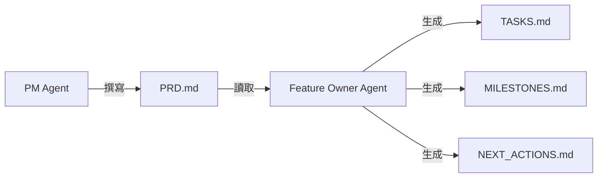
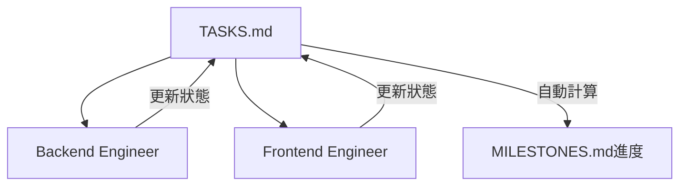
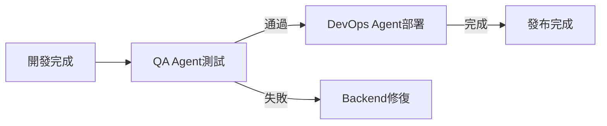

# AI Agent團隊協作系統

**版本**: 1.0  
**最後更新**: 2025-11-21

---

## 🎯 系統概述

這是一個基於文檔驅動的多AI Agent協作系統，每個Agent扮演特定角色，通過更新共享文檔來協作完成軟體開發任務。

### 核心理念

- **文檔驅動**: 所有Agent通過讀寫文檔進行交接
- **狀態追蹤**: TASKS.md和MILESTONES.md作為進度真相來源
- **角色專業化**: 每個Agent專注於特定領域
- **異步協作**: Agent可以獨立工作，通過文檔同步狀態

---

## 👥 Agent角色定義

### 1. PM Agent (Product Manager)
**職責**: 產品需求定義
**輸入**: 業務需求、用戶反饋
**輸出**: `docs/PRD_[FEATURE_NAME].md`
**工作流程**: 無（手動觸發）

---

### 2. Feature Owner Agent
**職責**: 專案規劃與進度管理
**輸入**: PRD文檔
**輸出**: 
- `docs/features/[feature-name]/TASKS.md`
- `docs/features/[feature-name]/MILESTONES.md`
- `docs/features/[feature-name]/NEXT_ACTIONS.md`

**調用方式**:
```
"立即開始按照 PRD_[FEATURE_NAME] 執行 Feature Owner 工作流程模板"
```

**工作流程**: `/feature-owner-main`

**完成標誌**:
- ✅ 任務列表已創建
- ✅ 里程碑已定義
- ✅ 下一步行動計劃已生成

---

### 3. Backend Engineer Agent
**職責**: 後端開發實作
**輸入**: 
- `TASKS.md` (分配給後端的任務)
- PRD技術規格
**輸出**: 
- 後端程式碼 (`src/services/`, `src/handlers/`)
- 單元測試
- API文檔

**調用方式**:
```
"我是Backend Engineer，請執行 [feature-name] 的 TASK-XXX"
```

**任務更新**:
完成後在TASKS.md中將狀態從 `[ ]` 更新為 `[x]`

---

### 4. Frontend Engineer Agent
**職責**: 前端/UI開發
**輸入**: 
- `TASKS.md` (前端任務)
- Flex Message設計規範
**輸出**: 
- Flex Message模板
- UI組件
- 前端測試

**調用方式**:
```
"我是Frontend Engineer，請實作 [feature-name] 的 TASK-XXX"
```

---

### 5. QA Agent
**職責**: 測試與質量保證
**輸入**: 
- `TASKS.md` (測試任務)
- 實作好的功能
**輸出**: 
- 測試報告
- Bug清單
- 測試覆蓋率報告

**調用方式**:
```
"我是QA Engineer，請執行 [feature-name] 的測試任務 TASK-XXX"
```

---

### 6. DevOps Agent
**職責**: 部署與運維
**輸入**: 
- `TASKS.md` (部署任務)
- 通過測試的程式碼
**輸出**: 
- 部署腳本
- 監控配置
- 部署報告

**調用方式**:
```
"我是DevOps Engineer，請執行 [feature-name] 的部署任務 TASK-XXX"
```

---

## 📋 工作流程

### Phase 1: 需求與規劃



**用戶操作**:
1. 扮演PM: `"撰寫 [功能] 的PRD"`
2. 切換Feature Owner: `"立即開始按照 PRD_XXX 執行 Feature Owner 工作流程"`

---

### Phase 2: 開發執行



**用戶操作**:
```
# 執行後端任務
"我是Backend Engineer，執行 line-new-features 的 TASK-101"

# 執行完畢，更新狀態
"將 TASK-101 標記為完成"

# 切換到前端
"我是Frontend Engineer，執行 TASK-104"
```

---

### Phase 3: 測試與部署



---

## 📊 進度追蹤機制

### TASKS.md 狀態更新

#### 任務狀態標記
- `[ ]` 待辦 (To Do)
- `[/]` 進行中 (In Progress)
- `[x]` 已完成 (Done)
- `[!]` 被阻塞 (Blocked)

#### 更新方式

**方式1: Agent主動更新**
```
"將 [feature-name]/TASKS.md 中的 TASK-XXX 狀態更新為已完成"
```

**方式2: Feature Owner Agent定期同步**
```
"我是Feature Owner，請同步 [feature-name] 的最新進度"
```

該Agent會:
1. 檢查git commit歷史
2. 檢查最近完成的檔案
3. 更新TASKS.md狀態
4. 重新計算里程碑進度

---

### MILESTONES.md 進度追蹤

#### 自動計算進度

Feature Owner Agent會根據TASKS.md自動計算：
- 每個里程碑的完成百分比
- 整體專案進度
- 速度趨勢
- 風險警示

#### 使用追蹤工具

```bash
// turbo
python scripts/feature-owner/track_milestone.py \
  --feature "line-new-features" \
  --status
```

**輸出範例**:
```
# line-new-features - Milestone Status Report

## Milestone Overview

### 🟢 M0: API調查
- Progress: 100% (6/6 tasks)
- Status: Completed

### 🟡 M1: 後端開發
- Progress: 50% (3/6 tasks)
- Status: In Progress
```

---

## 🔄 Agent切換與交接

### 交接檢查清單

#### Backend → Frontend 交接
- [ ] API端點已實作並測試
- [ ] 資料格式文檔已更新
- [ ] 在TASKS.md註明"Ready for Frontend"
- [ ] 通知Frontend Agent可以開始

#### Frontend → QA 交接
- [ ] UI已實作完成
- [ ] 自測通過
- [ ] 在TASKS.md更新狀態
- [ ] 部署到測試環境

#### QA → DevOps 交接
- [ ] 所有測試通過
- [ ] 測試報告已生成
- [ ] 無P0/P1 bug
- [ ] 獲得發布批准

---

## 💬 Agent協作範例

### 完整流程示範

#### Step 1: PM創建PRD
```
用戶: "我是PM，請撰寫 用戶通知系統 的PRD"
PM Agent: [生成 PRD_USER_NOTIFICATION.md]
```

#### Step 2: Feature Owner規劃
```
用戶: "立即開始按照 PRD_USER_NOTIFICATION 執行 Feature Owner 工作流程"
Feature Owner: [生成 TASKS.md, MILESTONES.md, NEXT_ACTIONS.md]
```

#### Step 3: Backend開發
```
用戶: "我是Backend Engineer，執行 user-notification 的 TASK-101: 實作NotificationService"
Backend Agent: 
  - 讀取TASK-101的需求
  - 實作 src/services/notificationService.ts
  - 撰寫單元測試
  - 更新TASKS.md: TASK-101 [x]
```

#### Step 4: 追蹤進度
```
用戶: "我是Feature Owner，同步 user-notification 的進度"
Feature Owner:
  - 讀取TASKS.md
  - 計算完成率: M1 16% (1/6)
  - 更新MILESTONES.md
  - 生成進度報告
```

#### Step 5: QA測試
```
用戶: "我是QA，執行 user-notification 的 TASK-301: 功能測試"
QA Agent:
  - 執行測試腳本
  - 生成測試報告
  - 發現2個bug，創建TASK-401, TASK-402
  - 標記TASK-301 [!] (被阻塞)
```

#### Step 6: Bug修復
```
用戶: "我是Backend Engineer，修復 TASK-401 bug"
Backend Agent:
  - 修復bug
  - 更新測試
  - TASK-401 [x]
  - 通知QA可以重新測試
```

---

## 🛠️ 自動化工具

### 進度追蹤
```bash
// turbo
python scripts/feature-owner/track_milestone.py --feature NAME --status
```

### 生成報告
```bash
// turbo
python scripts/feature-owner/generate_artifact.py \
  --feature NAME \
  --type milestone-report \
  --milestone M1
```

### 任務更新助手
```bash
// turbo
python scripts/feature-owner/update_task.py \
  --feature NAME \
  --task TASK-101 \
  --status completed
```

---

## 📈 進度可視化

### 儀表板

Feature Owner可以生成進度儀表板：

```
用戶: "我是Feature Owner，生成 [feature-name] 的進度儀表板"
```

**輸出** (DASHBOARD.md):
```markdown
# LINE New Features - 進度儀表板

## 總體進度
████████░░ 80%

## 里程碑狀態
✅ M0: API調查 (100%)
✅ M1: 後端開發 (100%)
🟡 M2: Webhook整合 (66%)
⏸️ M3: 測試 (0%)
⏸️ M4: 部署 (0%)

## 團隊速度
- 本週完成: 8 tasks
- 平均速度: 4 tasks/day
- 預計完成: 2025-11-25

## 風險警示
⚠️ TASK-205 被阻塞 3天
🔴 M2落後1天
```

---

## 🎯 最佳實踐

### 1. 明確角色切換
```
✅ 好的方式:
"我是Backend Engineer，執行 TASK-101"

❌ 不好的方式:
"幫我做 TASK-101"  // 不清楚由哪個Agent執行
```

### 2. 任務粒度控制
- 每個任務0.5-2天可完成
- 任務間依賴明確
- 驗收標準清晰

### 3. 及時更新狀態
- 任務完成立即更新TASKS.md
- 遇到阻塞立即標記 `[!]`
- Feature Owner每天同步進度

### 4. 文檔驅動交接
- 完成任務時更新相關文檔
- 在TASKS.md註明交接資訊
- 確保下一個Agent有足夠資訊開始工作

---

## 🔍 故障排除

### Q: Agent不知道從哪裡開始？

**A**: 檢查NEXT_ACTIONS.md，裡面有明確的下一步指引

### Q: 任務依賴關係不清楚？

**A**: 在TASKS.md中每個任務都有"依賴"欄位，檢查該欄位

### Q: 進度追蹤不準確？

**A**: 使用自動化工具重新計算：
```bash
python scripts/feature-owner/track_milestone.py --feature NAME --update
```

### Q: Agent之間資訊不同步？

**A**: Feature Owner執行同步：
```
"我是Feature Owner，同步並更新所有進度文檔"
```

---

## 📚 相關文檔

- [Feature Owner主工作流程](./workflows/feature-owner-main.md)
- [任務規劃工作流程](./workflows/task-planning.md)
- [里程碑追蹤工作流程](./workflows/milestone-tracking.md)
- [Artifact生成工作流程](./workflows/artifact-generation.md)

---

## 🚀 快速開始

### 1. PM創建PRD
```
"我是PM，撰寫 [功能名稱] 的PRD"
```

### 2. Feature Owner規劃
```
"立即開始按照 PRD_[名稱] 執行 Feature Owner 工作流程"
```

### 3. 開發團隊執行
```
# Backend
"我是Backend Engineer，執行 [feature] 的 TASK-XXX"

# Frontend  
"我是Frontend Engineer，執行 [feature] 的 TASK-XXX"

# QA
"我是QA，執行 [feature] 的測試"
```

### 4. 追蹤進度
```
"我是Feature Owner，生成 [feature] 的進度報告"
```

### 5. 部署發布
```
"我是DevOps，部署 [feature] 到生產環境"
```

---

**讓AI Agent團隊高效協作！** 🤖🤝🤖

---

**文檔維護**: Feature Owner工作流程團隊  
**最後更新**: 2025-11-21  
**版本**: 1.0
