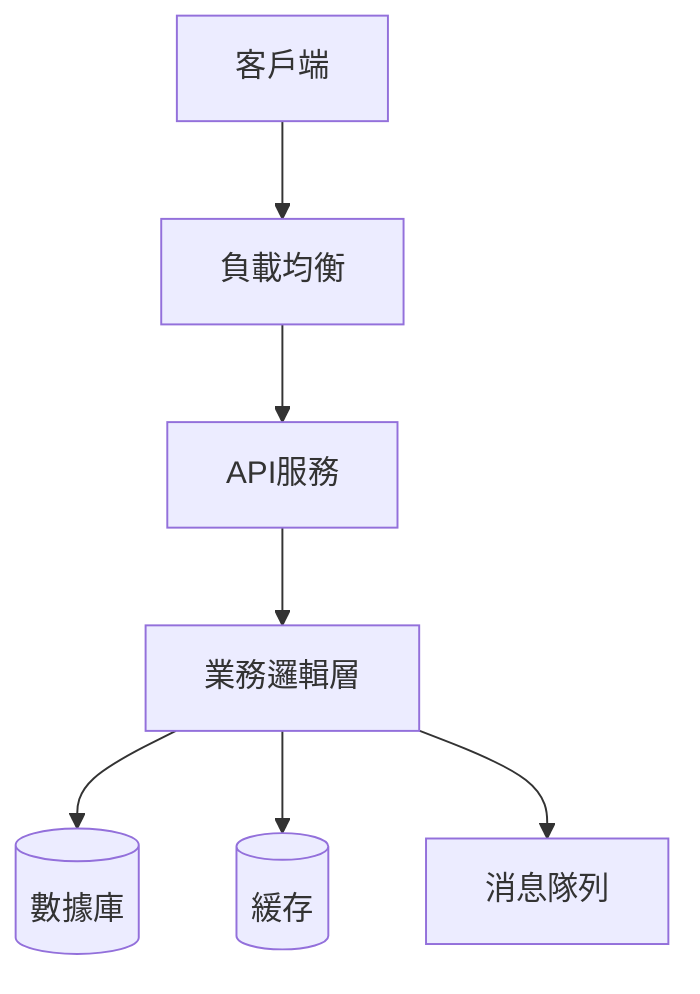
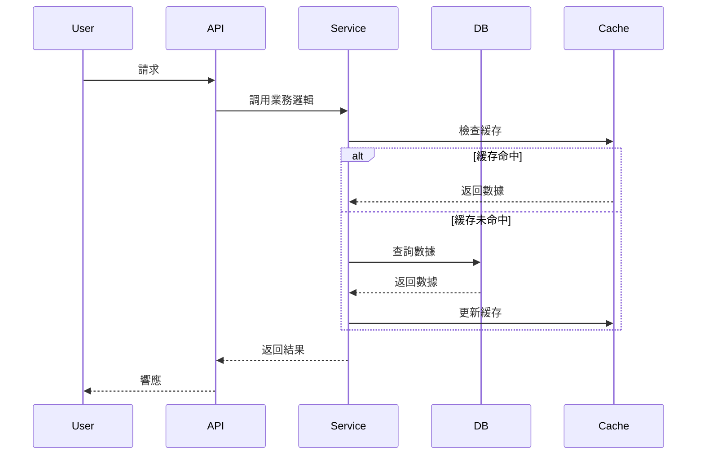

# [功能名稱] - 架構審查文檔

**日期**：YYYY-MM-DD  
**版本**：1.0  
**Feature Owner**：[姓名]  
**架構師**：[姓名]  
**狀態**：審查中 | 已批准 | 需修改

---

## 1. 概述

### 1.1 功能簡介

[簡要描述功能的業務目標和核心價值]

### 1.2 架構審查目標

本次架構審查旨在：
- ✅ 驗證技術方案的可行性
- ✅ 識別潛在的技術風險
- ✅ 確保方案符合系統整體架構
- ✅ 評估性能和擴展性
- ✅ 確認安全性和合規性

---

## 2. 系統架構

### 2.1 整體架構圖



[嵌入或鏈接詳細架構圖]

### 2.2 組件說明

#### 前端層
- **技術棧**：[React/Vue/Angular + 相關庫]
- **職責**：用戶界面渲染、用戶交互處理
- **部署**：CDN + 靜態託管

#### API層
- **技術棧**：[Node.js/Python/Java + 框架]
- **職責**：業務邏輯處理、數據驗證、API端點
- **部署**：容器化部署 (Docker + Kubernetes)

#### 數據層
- **主數據庫**：[PostgreSQL/MySQL/MongoDB]
- **緩存**：[Redis]
- **搜索**：[Elasticsearch]（如適用）

#### 基礎設施
- **雲平台**：[AWS/GCP/Azure]
- **容器編排**：Kubernetes
- **CI/CD**：[Jenkins/GitHub Actions]

### 2.3 數據流



---

##3. 數據模型設計

### 3.1 ER圖

[嵌入或鏈接ER圖]

### 3.2 核心實體

#### 實體1：[實體名稱]

**表名**：`table_name`

| 欄位 | 類型 | 約束 | 說明 | 索引 |
|------|------|------|------|------|
| id | UUID | PK | 主鍵 | PRIMARY |
| name | VARCHAR(255) | NOT NULL | 名稱 | INDEX |
| created_at | TIMESTAMP | NOT NULL | 創建時間 | INDEX |
| updated_at | TIMESTAMP | NOT NULL | 更新時間 | - |

**關係**：
- 與[實體2]：一對多關係
- 與[實體3]：多對多關係（通過中間表）

**索引策略**：
- 主鍵索引：id
- 查詢索引：name, created_at
- 複合索引：(user_id, created_at)

### 3.3 數據訪問模式

**讀寫比例**：70% 讀 / 30% 寫

**主要查詢模式**：
1. 按ID查詢（高頻）
2. 列表查詢帶分頁（中頻）
3. 複雜條件筆選（低頻）

**性能優化**：
- 熱數據緩存
- 讀寫分離
- 分頁查詢優化

---

## 4. API設計

### 4.1 API規範

- **風格**：RESTful
- **版本管理**：URL路徑版本（/api/v1/...）
- **認證**：JWT Bearer Token
- **數據格式**：JSON

### 4.2 核心端點

#### GET `/api/v1/resources`

**目的**：獲取資源列表

**請求參數**：
- `page` (int, optional): 頁碼，默認1
- `limit` (int, optional): 每頁數量，默認20
- `filter` (string, optional): 篩選條件

**響應**：
```json
{
  "data": [...],
  "pagination": {
    "page": 1,
    "limit": 20,
    "total": 100
  }
}
```

**性能要求**：< 500ms (95th percentile)

---

### 4.3 錯誤處理

**標準錯誤響應格式**：
```json
{
  "error": {
    "code": "RESOURCE_NOT_FOUND",
    "message": "資源不存在",
    "details": {}
  }
}
```

**HTTP狀態碼使用**：
- 2xx: 成功
- 4xx: 客戶端錯誤
- 5xx: 服務器錯誤

---

## 5. 安全性設計

### 5.1 認證與授權

**認證機制**：
- JWT Token認證
- Token有效期：24小時
- Refresh Token機制

**授權模型**：
- 基於角色的訪問控制（RBAC）
- 角色定義：Admin, User, Guest
- 資源級權限控制

### 5.2 數據保護

**傳輸加密**：
- HTTPS/TLS 1.3
- 證書管理策略

**存儲加密**：
- 敏感數據加密（AES-256）
- 密碼哈希（bcrypt）
- 密鑰管理（AWS KMS/Google Secret Manager）

### 5.3 安全措施

- [ ] SQL注入防護（參數化查詢）
- [ ] XSS防護（輸入驗證+輸出編碼）
- [ ] CSRF防護（Token驗證）
- [ ] 速率限制（API Gateway層）
- [ ] 輸入驗證和清理
- [ ] 安全審計日誌

---

## 6. 性能與擴展性

### 6.1 性能目標

| 指標 | 目標 | 測量方式 |
|------|------|---------|
| API響應時間 | < 500ms | 95百分位 |
| 頁面加載時間 | < 2s | 首屏加載 |
| 並發用戶 | ≥ 1000 | 同時在線 |
| 數據庫查詢 | < 100ms | 平均值 |
| 吞吐量 | ≥ 1000 req/s | 峰值 |

### 6.2 擴展策略

**水平擴展**：
- API服務：無狀態設計，支持動態擴展
- 數據庫：讀寫分離，必要時分片

**垂直擴展**：
- 數據庫配置優化
- 緩存層擴大

**緩存策略**：
- Redis緩存熱數據
- CDN緩存靜態資源
- API響應緩存（短時間）

### 6.3 性能優化措施

**後端優化**：
- 數據庫索引優化
- N+1查詢問題解決
- 連接池配置
- 異步處理非關鍵任務

**前端優化**：
- 代碼分割和懶加載
- 圖片優化和壓縮
- Bundle大小控制
- CDN分發

---

## 7. 可靠性與監控

### 7.1 高可用性設計

- **目標SLA**：99.9%
- **多可用區部署**：是
- **故障轉移**：自動
- **數據備份**：每日全量+實時增量

### 7.2 監控策略

**應用監控**：
- APM工具：[New Relic/DataDog/Prometheus]
- 關鍵指標：響應時間、錯誤率、吞吐量

**基礎設施監控**：
- CPU/內存/磁盤使用率
- 網絡流量
- 容器健康狀態

**業務監控**：
- 用戶活躍度
- 關鍵業務流程成功率
- 轉化率

### 7.3 告警配置

| 告警項 | 閾值 | 嚴重度 | 通知方式 |
|--------|------|--------|---------|
| API錯誤率 | > 1% | 高 | PagerDuty + Email |
| 響應時間 | > 1s | 中 | Email |
| 服務下線 | N/A | 緊急 | PagerDuty + SMS |
| 數據庫連接 | > 80% | 高 | Email |

---

## 8. 部署架構

### 8.1 環境規劃

| 環境 | 目的 | 配置 |
|------|------|------|
| 開發(Dev) | 日常開發 | 單實例 |
| 測試(Test) | 功能測試 | 簡化配置 |
| 預生產(Staging) | 發布前驗證 | 生產同配置 |
| 生產(Prod) | 正式服務 | 高可用配置 |

### 8.2 部署策略

**部署方式**：
- 滾動更新（Rolling Update）
- 藍綠部署（用於重大版本）

**回滾策略**：
- 保留最近3個版本
- 一鍵回滾能力
- 回滾時間 < 5分鐘

### 8.3 CI/CD Pipeline

```
代碼提交 → 自動測試 → 構建鏡像 → 部署到Test → 
自動化測試 → 部署到Staging → 手動驗收 → 部署到Prod
```

---

## 9. 技術風險評估

### 9.1 技術風險矩陣

| 風險 | 概率 | 影響 | 風險等級 | 緩解措施 |
|------|------|------|---------|---------|
| 外部API不穩定 | 中 | 高 | 🔴 高 | 實現重試機制+降級方案 |
| 性能不達標 | 低 | 中 | 🟡 中 | 早期性能測試+優化 |
| 數據遷移失敗 | 低 | 高 | 🟡 中 | 充分測試+回滾方案 |
| 團隊技術能力 | 中 | 中 | 🟡 中 | 培訓+pair programming |

### 9.2 依賴風險

**外部依賴**：
- [第三方服務名稱]：重要性高，需要備選方案
- [另一外部服務]：重要性中，可降級處理

**內部依賴**：
- [內部系統]：需要協調發布時間

---

## 10. 合規性與標準

### 10.1 法規遵循

- [ ] GDPR/個人數據保護法
- [ ] [行業特定法規]
- [ ] 數據本地化要求

### 10.2 技術標準

- [ ] 編碼規範：[鏈接]
- [ ] API設計規範：RESTful最佳實踐
- [ ] 安全編碼標準：OWASP Top 10
- [ ] 可訪問性：WCAG 2.1 AA

---

## 11. 技術債務與未來考慮

### 11.1 已知技術債務

| 項目 | 影響 | 計劃解決時間 |
|------|------|--------------|
| [技術債務描述] | 中 | v1.1 |

### 11.2 未來擴展考慮

**v1.0（當前版本）**：
- 核心功能實現

**v1.1（3個月後）**：
- [擴展功能1]
- [性能優化]

**v2.0（6個月後）**：
- [重大功能升級]
- [架構優化]

---

## 12. 審查問題與決議

### 審查會議信息

- **日期**：YYYY-MM-DD
- **參與者**：[列出參與者]
- **持續時間**：X小時

### 提出的問題

#### Q1: [問題描述]

**提出人**：[姓名]  
**討論結果**：[結果]  
**行動項**：[具體行動] - 負責人：[姓名]

#### Q2: [問題描述]

[同上結構]

### 架構決策

#### 決策1: [決策標題]

**背景**：[為什麼需要做這個決策]

**選項**：
- 方案A：[簡述]
- 方案B：[簡述]

**決定**：選擇方案B

**理由**：[決策理由]

**影響**：[對專案的影響]

**ADR**：[鏈接到詳細ADR文檔]

---

## 13. 審查結論

### 13.1 審查結果

- ✅ 批准 - 可以開始實施
- ⚠️ 有條件批准 - 需要解決特定問題後實施
- ❌ 不批准 - 需要重大修改後重新審查

**當前狀態**：[選擇一個]

### 13.2 必須解決的問題（如有）

1. [問題1] - 負責人：[姓名] - 截止日期：YYYY-MM-DD
2. [問題2] - 負責人：[姓名] - 截止日期：YYYY-MM-DD

### 13.3 建議改進項（可選）

1. [建議1]
2. [建議2]

### 13.4 審批簽字

| 角色 | 姓名 | 審批 | 日期 | 備註 |
|------|------|------|------|------|
| 架構師 | [姓名] | ✅/❌ | YYYY-MM-DD | [意見] |
| 技術負責人 | [姓名] | ✅/❌ | YYYY-MM-DD | [意見] |
| 安全專家 | [姓名] | ✅/❌ | YYYY-MM-DD | [意見] |
| Feature Owner | [姓名] | ✅/❌ | YYYY-MM-DD | [意見] |

---

## 14. 附錄

### 14.1 參考文檔

- [PRD文檔](./PRD.md)
- [技術調研報告]
- [性能基準測試結果]
- [競品技術分析]

### 14.2 相關ADR

- [ADR-001: 數據庫選擇](./artifacts/adr/001-database-choice.md)
- [ADR-002: 認證方案](./artifacts/adr/002-authentication.md)

---

**文檔所有者**：[Feature Owner姓名]  
**最後更新**：YYYY-MM-DD  
**下次審查**：YYYY-MM-DD（如適用）
