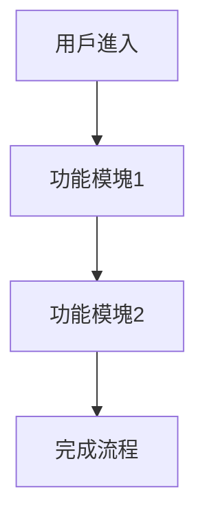

# [功能名稱] - 產品需求文檔 (PRD)

**版本**：1.0  
**日期**：YYYY-MM-DD  
**負責人**：[Feature Owner姓名]  
**狀態**：草稿 | 審查中 | 已批准

---

## 文檔變更歷史

| 版本 | 日期 | 變更內容 | 變更人 |
|------|------|----------|--------|
| 1.0 | YYYY-MM-DD | 初始版本 | [姓名] |

---

## 執行摘要

> 用2-3段文字簡要描述這個功能的核心價值、目標用戶和預期影響。這部分應該讓任何讀者快速理解功能的本質。

**關鍵要點**：
- 🎯 **目標**：[一句話描述功能目標]
- 👥 **用戶**：[主要目標用戶群]
- 📊 **成功指標**：[主要成功指標]
- 📅 **計劃時間線**：[預計開始和完成時間]

---

## 1. 背景與目標

### 1.1 業務背景

**當前狀況**：
- [描述當前的情況和痛點]
- [說明為什麼需要這個功能]

**市場機會**：
- [市場需求分析]
- [競爭對手情況]
- [用戶反饋或數據支持]

**戰略對齊**：
- [這個功能如何支持公司/產品戰略]
- [與產品路線圖的關係]

### 1.2 業務目標

**主要目標**：
1. [目標1 - 應該是可衡量的]
2. [目標2]
3. [目標3]

**關鍵成果（OKRs）**：

| 目標 (Objective) | 關鍵結果 (Key Results) | 衡量方式 | 目標值 |
|-----------------|----------------------|---------|--------|
| [目標1] | KR1: [具體可衡量的結果] | [如何衡量] | [目標數值] |
|  | KR2: [具體可衡量的結果] | [如何衡量] | [目標數值] |
| [目標2] | KR1: [具體可衡量的結果] | [如何衡量] | [目標數值] |

### 1.3 成功指標

**主要指標**：
- **[指標名稱]**：[當前基線] → [目標值]（時間範圍）
- **[指標名稱]**：[當前基線] → [目標值]（時間範圍）

**次要指標**：
- [指標1]
- [指標2]

---

## 2. 目標用戶

### 2.1 用戶角色

#### 主要用戶：[用戶角色1]

**人口統計**：
- 年齡：[範圍]
- 職業：[描述]
- 技術熟練度：[低/中/高]

**行為特徵**：
- [特徵1]
- [特徵2]

**需求和痛點**：
- 需求：[描述]
- 痛點：[描述]

**使用場景**：[描述典型使用情境]

#### 次要用戶：[用戶角色2]
[同上結構]

### 2.2 用戶故事

#### User Story 1: [標題]
```
作為 [用戶角色]
我想要 [功能]
以便於 [達成目標/解決問題]
```

**驗收標準**：
- [ ] [標準1]
- [ ] [標準2]
- [ ] [標準3]

**優先級**：P0 (Must Have) | P1 (Should Have) | P2 (Nice to Have)

---

#### User Story 2: [標題]
[同上結構]

---

## 3. 功能需求

### 3.1 功能概述

[整體功能描述，可包含流程圖或架構圖]



### 3.2 詳細功能需求

#### 功能模塊1：[模塊名稱]

**描述**：[詳細描述這個功能模塊]

**功能要求**：

##### F1.1 [具體功能名稱]

**優先級**：P0 | P1 | P2

**功能描述**：
[詳細描述功能行為]

**用戶交互**：
1. 用戶執行 [操作]
2. 系統顯示 [結果]
3. 用戶可以 [後續操作]

**業務規則**：
- 規則1：[描述]
- 規則2：[描述]

**輸入**：
- 參數1：[類型，範圍，必需/可選]
- 參數2：[類型，範圍，必需/可選]

**輸出**：
- [描述預期輸出]

**錯誤處理**：
- 錯誤情況1：[錯誤消息和處理方式]
- 錯誤情況2：[錯誤消息和處理方式]

**驗收標準**：
- [ ] [可測試的標準1]
- [ ] [可測試的標準2]
- [ ] [可測試的標準3]

---

##### F1.2 [具體功能名稱]
[同上結構]

---

#### 功能模塊2：[模塊名稱]
[同上結構]

---

### 3.3 用戶界面要求

**設計原則**：
- [原則1，例如：簡潔直觀]
- [原則2，例如：一致性]
- [原則3，例如：可訪問性]

**主要頁面/視圖**：

#### 頁面1：[頁面名稱]

**目的**：[這個頁面的主要目的]

**內容元素**：
- 元素1：[描述]
- 元素2：[描述]

**交互**：
- 操作1 → 結果1
- 操作2 → 結果2

**布局要求**：
- [響應式設計要求]
- [不同設備的考慮]

**UI Mockup**：[鏈接到設計稿或嵌入圖片]

---

### 3.4 數據需求

**數據模型**：

#### 實體1：[實體名稱]

| 欄位名稱 | 類型 | 必需 | 說明 | 驗證規則 |
|---------|------|------|------|---------|
| id | UUID | 是 | 唯一標識符 | 自動生成 |
| name | String | 是 | 名稱 | 長度2-100字符 |
| created_at | DateTime | 是 | 創建時間 | 自動設置 |

**關係**：
- [與其他實體的關係]

**索引**：
- [需要建立的索引]

---

## 4. 非功能需求

### 4.1 性能要求

| 指標 | 要求 | 衡量方式 |
|------|------|---------|
| 頁面加載時間 | < 2秒 | 95百分位 |
| API響應時間 | < 500ms | 平均值 |
| 並發用戶 | ≥ 1000 | 同時在線 |
| 數據吞吐量 | [具體數值] | [單位時間內處理量] |

### 4.2 可用性要求

- **系統可用性**：99.9% SLA
- **計劃維護窗口**：[時間]
- **故障恢復時間目標（RTO）**：[時間]
- **故障恢復點目標（RPO）**：[時間]

### 4.3 安全性要求

**認證與授權**：
- [ ] 用戶身份認證機制
- [ ] 基於角色的訪問控制（RBAC）
- [ ] API密鑰/Token管理

**數據保護**：
- [ ] 敏感數據加密（傳輸和存儲）
- [ ] 個人信息保護(遵循GDPR/CCPA等)
- [ ] 數據脫敏和匿名化

**安全措施**：
- [ ] SQL注入防護
- [ ] XSS攻擊防護
- [ ] CSRF防護
- [ ] 速率限制和DDoS防護
- [ ] 安全審計日誌

### 4.4 可擴展性要求

- **水平擴展能力**：[描述]
- **數據庫擴展策略**：[例如：分片、讀寫分離]
- **緩存策略**：[描述]
- **CDN使用**：[如適用]

### 4.5 可維護性要求

- **代碼質量**：
  - 單元測試覆蓋率 ≥ 80%
  - 代碼審查機制
  - 遵循編碼規範

- **監控和日誌**：
  - 應用性能監控（APM）
  - 錯誤追蹤和告警
  - 詳細的操作日誌

- **文檔要求**：
  - API文檔
  - 部署文檔
  - 用戶指南

### 4.6 兼容性要求

**瀏覽器支持**：
- Chrome (最新版本及前2個版本)
- Firefox (最新版本及前2個版本)
- Safari (最新版本及前2個版本)
- Edge (最新版本及前2個版本)

**移動設備**：
- iOS ≥ 14
- Android ≥ 10

**API兼容性**：
- 向後兼容性保證
- 版本管理策略

### 4.7 可訪問性要求

- [ ] 符合 WCAG 2.1 AA 標準
- [ ] 鍵盤導航支持
- [ ] 屏幕閱讀器兼容
- [ ] 色彩對比度符合標準

---

## 5. 技術考量

### 5.1 技術棧建議

**前端**：
- 框架：[例如：React, Vue, Angular]
- 狀態管理：[例如：Redux, Vuex]
- UI庫：[例如：Material-UI, Ant Design]

**後端**：
- 語言/框架：[例如：Node.js/Express, Python/Django]
- API風格：[REST, GraphQL]

**數據庫**：
- 主數據庫：[例如：PostgreSQL, MySQL]
- 緩存：[例如：Redis]
- 搜索：[例如：Elasticsearch]（如適用）

**基礎設施**：
- 雲平台：[例如：AWS, GCP, Azure]
- 容器化：[Docker, Kubernetes]
- CI/CD：[Jenkins, GitHub Actions]

### 5.2 系統集成

**需要集成的外部系統**：

| 系統名稱 | 集成目的 | 集成方式 | 依賴程度 |
|---------|---------|---------|---------|
| [系統1] | [目的] | REST API | 高/中/低 |
| [系統2] | [目的] | Webhook | 高/中/低 |

### 5.3 技術風險

| 風險 | 影響 | 概率 | 緩解措施 |
|------|------|------|---------|
| [技術風險1] | 高/中/低 | 高/中/低 | [緩解措施] |
| [技術風險2] | 高/中/低 | 高/中/低 | [緩解措施] |

---

## 6. 範圍界定

### 6.1 包含在範圍內 (In Scope)

✅ [明確列出這個版本會實現的功能]
✅ [功能2]
✅ [功能3]

### 6.2 不包含在範圍內 (Out of Scope)

❌ [明確列出不會實現的功能，避免混淆]
❌ [功能2]
❌ [功能3]

**說明**：[解釋為什麼某些功能不在範圍內，可能在未來版本考慮]

### 6.3 未來考慮 (Future Considerations)

🔮 [可能在未來版本實現的功能]
🔮 [功能2]
🔮 [功能3]

---

## 7. 依賴和約束

### 7.1 依賴項

**內部依賴**：
- [ ] [依賴的內部系統/服務]
- [ ] [依賴的團隊/資源]

**外部依賴**：
- [ ] [第三方服務/API]
- [ ] [外部數據源]

**技術依賴**：
- [ ] [技術棧或工具]
- [ ] [基礎設施]

### 7.2 約束條件

**時間約束**：
- 必須在 [日期] 前完成，因為 [原因]

**預算約束**：
- [預算限制，如有]

**技術約束**：
- 必須使用 [特定技術]，因為 [原因]
- 不能使用 [特定技術]，因為 [原因]

**法規/合規約束**：
- 必須符合 [法規/標準]
- [數據處理限制]

**資源約束**：
- 開發團隊：[人數和技能]
- 測試資源：[描述]

---

## 8. 發布計劃

### 8.1 里程碑

| 里程碑 | 目標日期 | 主要交付物 | 負責人 |
|--------|---------|-----------|--------|
| M0: 設計完成 | YYYY-MM-DD | 技術方案、UI設計 | [姓名] |
| M1: 核心功能 | YYYY-MM-DD | 基礎API、數據模型 | [姓名] |
| M2: 完整功能 | YYYY-MM-DD | 所有功能實現 | [姓名] |
| M3: 測試與優化 | YYYY-MM-DD | 測試完成、性能優化 | [姓名] |
| M4: 發布就緒 | YYYY-MM-DD | 文檔、部署 | [姓名] |

### 8.2 發布策略

**發布類型**：
- [ ] 完整發布
- [ ] 灰度發布（逐步放量）
- [ ] A/B測試
- [ ] Beta測試

**回滾計劃**：
[描述如果發布出現問題如何回滾]

### 8.3 用戶溝通計劃

**發布前**：
- [通知方式和時間]
- [培訓計劃]（如適用）

**發布時**：
- [發布公告渠道]
- [支持準備]

**發布後**：
- [用戶反饋收集機制]
- [問題響應計劃]

---

## 9. 風險管理

### 9.1 識別的風險

| ID | 風險描述 | 影響 | 概率 | 緩解策略 | 應急計劃 | 負責人 |
|----|---------|------|------|---------|---------|--------|
| R1 | [風險描述] | 高/中/低 | 高/中/低 | [預防措施] | [問題發生時的應對] | [姓名] |
| R2 | [風險描述] | 高/中/低 | 高/中/低 | [預防措施] | [問題發生時的應對] | [姓名] |

### 9.2 假設條件

列出做出本計劃時的假設：
- [假設1]
- [假設2]

**如果假設不成立**：[影響和應對措施]

---

## 10. 驗收標準

### 10.1 功能驗收

- [ ] 所有P0功能完整實現並通過測試
- [ ] 所有P1功能完整實現並通過測試
- [ ] 所有User Story的驗收標準滿足

### 10.2 質量驗收

- [ ] 單元測試覆蓋率 ≥ 80%
- [ ] 集成測試全部通過
- [ ] E2E測試覆蓋主要用戶流程
- [ ] 性能指標達標
- [ ] 安全掃描無高危漏洞
- [ ] 可訪問性測試通過

### 10.3 文檔驗收

- [ ] API文檔完整
- [ ] 用戶指南完成
- [ ] 部署文檔準備就緒
- [ ] 發布說明撰寫完成

### 10.4 用戶驗收測試（UAT）

**UAT計劃**：
- 測試用戶：[描述測試用戶群]
- 測試場景：[關鍵場景列表]
- 成功標準：[例如：80%的用戶能夠獨立完成核心任務]

---

## 11. 支持和維護

### 11.1 運維準備

- [ ] 監控儀表板配置
- [ ] 告警規則設置
- [ ] 日誌聚合和分析
- [ ] 性能基準建立

### 11.2 支持計劃

**客戶支持**：
- 支持渠道：[email, 工單系統等]
- 響應時間SLA：[時間要求]
- 支持團隊培訓計劃

**技術支持**：
- On-call輪值：[安排]
- 故障響應流程
- 升級路徑

### 11.3 維護計劃

- 定期維護窗口：[時間]
- 補丁更新策略
- 技術債務管理

---

## 12. 附錄

### 12.1 術語表

| 術語 | 定義 |
|------|------|
| [術語1] | [定義] |
| [術語2] | [定義] |

### 12.2 參考資料

- [相關文檔鏈接]
- [市場研究報告]
- [技術規範]
- [設計文件]

### 12.3 利益相關者

| 姓名 | 角色 | 責任 | 聯繫方式 |
|------|------|------|---------|
| [姓名] | 產品經理 | PRD審批 | [email] |
| [姓名] | Feature Owner | 執行 | [email] |
| [姓名] | 架構師 | 技術審查 | [email] |
| [姓名] | 工程經理 | 資源分配 | [email] |

### 12.4 會議記錄

**PRD審查會議**：
- 日期：[日期]
- 參與者：[列表]
- 主要決議：[摘要]
- 行動項：[列表]

---

## 審批簽字

| 角色 | 姓名 | 簽字 | 日期 |
|------|------|------|------|
| 產品經理 |  |  |  |
| 工程經理 |  |  |  |
| 架構師 |  |  |  |
| Feature Owner |  |  |  |

---

**文檔所有者**：[姓名]  
**最後更新**：YYYY-MM-DD  
**下次審查**：YYYY-MM-DD
