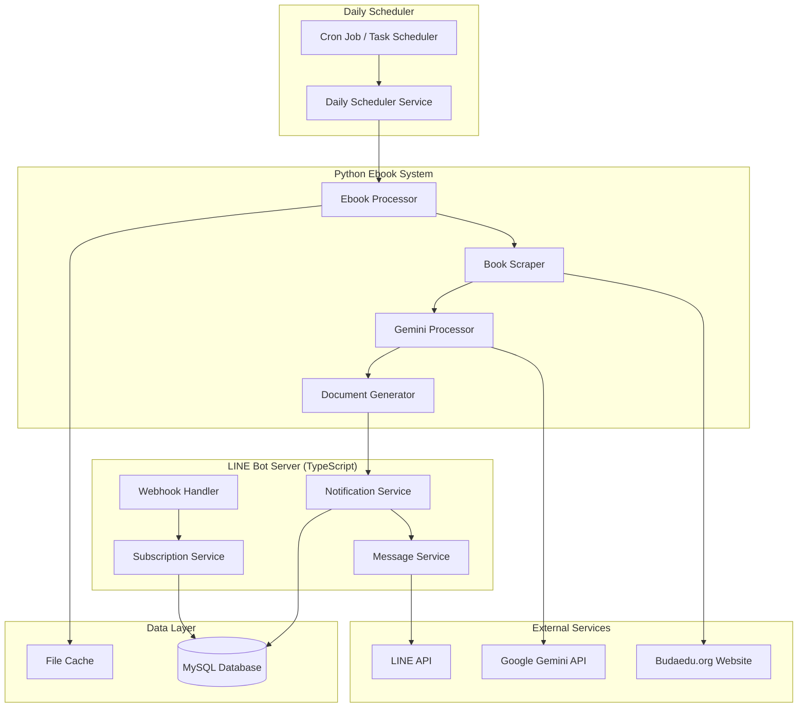

# Design Document

## Overview

The daily book notifications system extends the existing LINE bot and ebook processing infrastructure to provide automated daily notifications about new Buddhist education books. The system integrates the Python ebook processor with the TypeScript LINE bot server through a scheduled workflow that processes new books and delivers formatted notifications to subscribed users.

## Architecture

### System Components



### Integration Points

1. **File-based Communication**: The Python ebook processor outputs processed book data to a JSON file that the LINE bot server monitors
2. **Database Integration**: User subscription preferences stored in MySQL database
3. **Shared Configuration**: Common notification settings accessible to both systems
4. **API Integration**: Both systems use Google Gemini API for AI processing

## Components and Interfaces

### 1. Daily Scheduler Service

**Purpose**: Orchestrates the daily execution of ebook processing and notification delivery

**Key Methods**:
- `scheduleDailyProcessing()`: Sets up recurring daily execution
- `executeEbookWorkflow()`: Triggers Python ebook processor
- `triggerNotifications()`: Initiates notification delivery after processing
- `handleProcessingFailure()`: Implements retry logic with exponential backoff

**Configuration**:
```typescript
interface SchedulerConfig {
  dailyExecutionTime: string; // "02:00" (2 AM)
  maxRetries: number; // 3
  retryDelayMinutes: number; // 30
  timeZone: string; // "Asia/Taipei"
}
```

### 2. Subscription Service

**Purpose**: Manages user subscription preferences and LINE user data

**Database Schema**:
```sql
CREATE TABLE user_subscriptions (
  id INT PRIMARY KEY AUTO_INCREMENT,
  line_user_id VARCHAR(255) UNIQUE NOT NULL,
  display_name VARCHAR(255),
  is_subscribed BOOLEAN DEFAULT FALSE,
  subscription_date TIMESTAMP DEFAULT CURRENT_TIMESTAMP,
  last_notification_sent TIMESTAMP NULL,
  notification_preferences JSON,
  created_at TIMESTAMP DEFAULT CURRENT_TIMESTAMP,
  updated_at TIMESTAMP DEFAULT CURRENT_TIMESTAMP ON UPDATE CURRENT_TIMESTAMP,
  INDEX idx_line_user_id (line_user_id),
  INDEX idx_is_subscribed (is_subscribed)
);
```

**Key Methods**:
```typescript
interface SubscriptionService {
  subscribeUser(lineUserId: string, displayName?: string): Promise<boolean>;
  unsubscribeUser(lineUserId: string): Promise<boolean>;
  getSubscribedUsers(): Promise<UserSubscription[]>;
  isUserSubscribed(lineUserId: string): Promise<boolean>;
  updateLastNotificationSent(lineUserId: string): Promise<void>;
}
```

### 3. Notification Service

**Purpose**: Processes new book data and delivers notifications to subscribed users

**Input Interface** (from Python ebook processor):
```typescript
interface ProcessedBookData {
  processingDate: string;
  totalBooksFound: number;
  successfullyProcessed: BookSummary[];
  processingStats: {
    booksProcessed: number;
    booksFailed: number;
    pdfExtractions: number;
    googleSearches: number;
  };
}

interface BookSummary {
  title: string;
  author?: string;
  summary: string;
  downloadUrl: string;
  processingMethod: 'pdf_extract' | 'google_search';
  processingSuccess: boolean;
}
```

**Key Methods**:
```typescript
interface NotificationService {
  processNewBooks(bookData: ProcessedBookData): Promise<void>;
  createNotificationMessages(books: BookSummary[]): NotificationMessage[];
  deliverNotifications(messages: NotificationMessage[]): Promise<DeliveryResult>;
  handleDeliveryFailures(failures: DeliveryFailure[]): Promise<void>;
}
```

### 4. Enhanced Webhook Handler

**Purpose**: Extends existing webhook handler to support subscription commands

**New Message Handlers**:
```typescript
interface SubscriptionCommands {
  "訂閱新書": () => Promise<void>; // Subscribe to notifications
  "取消訂閱": () => Promise<void>; // Unsubscribe from notifications
  "訂閱狀態": () => Promise<void>; // Check subscription status
}
```

**Enhanced Menu System**:
```typescript
interface QuickReplyMenu {
  bookQuery: QuickReplyButton[];
  subscription: QuickReplyButton[];
  help: QuickReplyButton[];
}
```

## Data Models

### User Subscription Model

```typescript
interface UserSubscription {
  id: number;
  lineUserId: string;
  displayName?: string;
  isSubscribed: boolean;
  subscriptionDate: Date;
  lastNotificationSent?: Date;
  notificationPreferences: NotificationPreferences;
  createdAt: Date;
  updatedAt: Date;
}

interface NotificationPreferences {
  enableSummary: boolean; // Include AI-generated summary
  enableDownloadLink: boolean; // Include PDF download link
  maxBooksPerNotification: number; // Limit books per message
}
```

### Notification Message Model

```typescript
interface NotificationMessage {
  id: string;
  recipientUserId: string;
  messageType: 'single_book' | 'multiple_books' | 'daily_summary';
  content: MessageContent;
  deliveryStatus: 'pending' | 'sent' | 'failed';
  createdAt: Date;
  sentAt?: Date;
  errorMessage?: string;
}

interface MessageContent {
  text: string;
  quickReply?: QuickReplyButton[];
  flexMessage?: FlexMessage;
}
```

### Processing Result Model

```typescript
interface DeliveryResult {
  totalRecipients: number;
  successfulDeliveries: number;
  failedDeliveries: number;
  deliveryFailures: DeliveryFailure[];
  processingTime: number;
}

interface DeliveryFailure {
  userId: string;
  errorType: 'user_blocked' | 'invalid_user' | 'rate_limit' | 'api_error';
  errorMessage: string;
  retryable: boolean;
}
```

## Error Handling

### Retry Strategy

1. **Ebook Processing Failures**:
   - Retry up to 3 times with exponential backoff (30min, 1hr, 2hr)
   - Log detailed error information for debugging
   - Continue with notification delivery even if some books fail

2. **Notification Delivery Failures**:
   - Immediate retry for transient errors (rate limits, temporary API issues)
   - Mark users as inactive after persistent delivery failures
   - Maintain delivery failure logs for analysis

3. **Database Connection Issues**:
   - Connection pool with automatic reconnection
   - Graceful degradation when database is unavailable
   - Cache subscription data for emergency scenarios

### Error Categories

```typescript
enum ErrorType {
  EBOOK_PROCESSING_FAILED = 'ebook_processing_failed',
  NOTIFICATION_DELIVERY_FAILED = 'notification_delivery_failed',
  DATABASE_CONNECTION_FAILED = 'database_connection_failed',
  LINE_API_ERROR = 'line_api_error',
  GEMINI_API_ERROR = 'gemini_api_error',
  CONFIGURATION_ERROR = 'configuration_error'
}
```

## Testing Strategy

### Unit Testing

1. **Subscription Service Tests**:
   - User subscription/unsubscription workflows
   - Database operations and data integrity
   - Edge cases (duplicate subscriptions, invalid user IDs)

2. **Notification Service Tests**:
   - Message formatting and content generation
   - Delivery logic and failure handling
   - Rate limiting and batch processing

3. **Scheduler Service Tests**:
   - Cron job scheduling and execution
   - Retry logic and failure recovery
   - Integration with ebook processor

### Integration Testing

1. **End-to-End Workflow Tests**:
   - Complete daily processing cycle
   - Python-to-TypeScript data flow
   - Database persistence and retrieval

2. **LINE API Integration Tests**:
   - Message delivery to test users
   - Webhook event processing
   - Error response handling

3. **Database Integration Tests**:
   - Schema validation and migrations
   - Connection pooling and performance
   - Data consistency across operations

### Performance Testing

1. **Scalability Tests**:
   - Notification delivery to large user base (1000+ users)
   - Database query performance under load
   - Memory usage during batch processing

2. **Reliability Tests**:
   - System behavior during network outages
   - Recovery from partial failures
   - Data integrity after interruptions

## Security Considerations

### Data Protection

1. **User Privacy**:
   - Minimal data collection (only LINE user ID and subscription status)
   - Secure storage of user preferences
   - GDPR-compliant data handling

2. **API Security**:
   - Secure storage of API keys and credentials
   - Rate limiting to prevent abuse
   - Input validation and sanitization

3. **Database Security**:
   - Parameterized queries to prevent SQL injection
   - Connection encryption (SSL/TLS)
   - Regular security updates and patches

### Access Control

1. **Service Authentication**:
   - Secure communication between Python and TypeScript services
   - File-based data exchange with proper permissions
   - Environment-specific configuration management

2. **LINE Platform Security**:
   - Webhook signature validation
   - Channel access token protection
   - User identity verification

## Deployment and Configuration

### Environment Configuration

```typescript
interface NotificationConfig {
  scheduler: {
    dailyExecutionTime: string;
    timeZone: string;
    maxRetries: number;
    retryDelayMinutes: number;
  };
  notifications: {
    maxRecipientsPerBatch: number;
    deliveryTimeoutMs: number;
    maxBooksPerMessage: number;
    enableRichMessages: boolean;
  };
  integration: {
    ebookDataPath: string;
    pythonExecutablePath: string;
    ebookScriptPath: string;
  };
}
```

### Database Migrations

```sql
-- Migration 001: Create user_subscriptions table
CREATE TABLE user_subscriptions (
  id INT PRIMARY KEY AUTO_INCREMENT,
  line_user_id VARCHAR(255) UNIQUE NOT NULL,
  display_name VARCHAR(255),
  is_subscribed BOOLEAN DEFAULT FALSE,
  subscription_date TIMESTAMP DEFAULT CURRENT_TIMESTAMP,
  last_notification_sent TIMESTAMP NULL,
  notification_preferences JSON,
  created_at TIMESTAMP DEFAULT CURRENT_TIMESTAMP,
  updated_at TIMESTAMP DEFAULT CURRENT_TIMESTAMP ON UPDATE CURRENT_TIMESTAMP,
  INDEX idx_line_user_id (line_user_id),
  INDEX idx_is_subscribed (is_subscribed)
);

-- Migration 002: Create notification_logs table
CREATE TABLE notification_logs (
  id INT PRIMARY KEY AUTO_INCREMENT,
  processing_date DATE NOT NULL,
  total_recipients INT NOT NULL,
  successful_deliveries INT NOT NULL,
  failed_deliveries INT NOT NULL,
  books_processed INT NOT NULL,
  processing_duration_seconds INT,
  created_at TIMESTAMP DEFAULT CURRENT_TIMESTAMP,
  INDEX idx_processing_date (processing_date)
);

-- Migration 003: Create delivery_failures table
CREATE TABLE delivery_failures (
  id INT PRIMARY KEY AUTO_INCREMENT,
  notification_log_id INT,
  line_user_id VARCHAR(255) NOT NULL,
  error_type VARCHAR(50) NOT NULL,
  error_message TEXT,
  is_retryable BOOLEAN DEFAULT FALSE,
  retry_count INT DEFAULT 0,
  created_at TIMESTAMP DEFAULT CURRENT_TIMESTAMP,
  FOREIGN KEY (notification_log_id) REFERENCES notification_logs(id),
  INDEX idx_line_user_id (line_user_id),
  INDEX idx_error_type (error_type)
);
```

### Monitoring and Metrics

1. **System Metrics**:
   - Daily processing success rate
   - Notification delivery statistics
   - User subscription growth
   - Error frequency and types

2. **Performance Metrics**:
   - Processing time per book
   - Notification delivery latency
   - Database query performance
   - Memory and CPU usage

3. **Business Metrics**:
   - User engagement with notifications
   - Subscription conversion rate
   - Content quality feedback
   - System reliability uptime