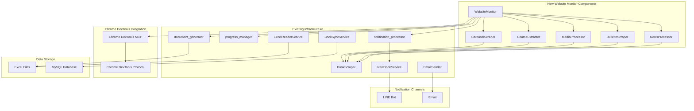

# Design Document

## Overview

This design extends the existing Buddhist Education monitoring infrastructure to provide comprehensive website monitoring capabilities. The system will integrate with existing components (BookScraper, EmailSender, NewBookService, document_generator, etc.) to monitor carousel banners, course information, multimedia content, course cancellations, and news announcements from the Buddhist Education website.

## Architecture

### High-Level Architecture



### Component Integration Strategy

The design follows a composition pattern where new monitoring components extend existing functionality rather than replacing it:

1. **WebsiteMonitor** acts as the main orchestrator, coordinating all monitoring activities
2. **Specialized scrapers** (CarouselScraper, BulletinScraper, etc.) extend BookScraper functionality
3. **Data processing** leverages existing document_generator and progress_manager
4. **Notification system** integrates with existing EmailSender and NewBookService infrastructure

## Components and Interfaces

### 1. WebsiteMonitor (Main Orchestrator)

**Purpose**: Central coordinator for all website monitoring activities

**Key Responsibilities**:
- Initialize and coordinate all specialized scrapers
- Manage monitoring schedules and cycles
- Handle error recovery and retry logic
- Coordinate data synchronization and notifications

**Interface**:
```python
class WebsiteMonitor:
    def __init__(self, config: Dict[str, Any], logger: Logger)
    def start_monitoring_cycle(self) -> bool
    def process_carousel_content(self) -> List[Dict]
    def process_course_content(self) -> List[Dict]
    def process_media_content(self) -> List[Dict]
    def process_bulletin_content(self) -> List[Dict]
    def process_news_content(self) -> List[Dict]
    def synchronize_data(self, content_data: List[Dict]) -> bool
    def send_notifications(self, new_content: List[Dict]) -> bool
```

### 2. CarouselScraper (Extends BookScraper)

**Purpose**: Extract carousel banner information from the homepage

**Key Responsibilities**:
- Navigate to homepage and identify carousel elements
- Extract banner images and click to get activity details
- Process popup dialogs for course information
- Format data for storage and notification

**Interface**:
```python
class CarouselScraper(BookScraper):
    def extract_carousel_banners(self) -> List[Dict]
    def process_banner_popup(self, banner_element) -> Dict
    def get_carousel_baseline(self) -> str
    def update_carousel_baseline(self, latest_banner: str) -> bool
```

**Data Structure**:
```python
{
    'carousel_id': str,
    'banner_title': str,
    'image_url': str,
    'activity_link': str,
    'course_name': str,
    'location': str,
    'instructor': str,
    'description': str,
    'extraction_timestamp': datetime,
    'content_type': 'carousel'
}
```

### 3. BulletinScraper (Extends BookScraper)

**Purpose**: Extract course cancellation information from bulletin tables

**Key Responsibilities**:
- Navigate to course cancellation page
- Extract table data (date, course, instructor)
- Detect new cancellations based on baseline
- Format structured data for storage

**Interface**:
```python
class BulletinScraper(BookScraper):
    def extract_cancellation_table(self) -> List[Dict]
    def parse_table_row(self, row_element) -> Dict
    def get_cancellation_baseline(self) -> datetime
    def update_cancellation_baseline(self, latest_date: datetime) -> bool
```

**Data Structure**:
```python
{
    'cancellation_id': str,
    'cancellation_date': date,
    'course_name': str,
    'instructor_name': str,
    'extraction_timestamp': datetime,
    'content_type': 'cancellation'
}
```

### 4. NewsProcessor (Extends BookScraper)

**Purpose**: Extract news announcements and popup content

**Key Responsibilities**:
- Navigate to news bulletin page
- Identify and click news items
- Extract popup dialog content
- Process announcement details

**Interface**:
```python
class NewsProcessor(BookScraper):
    def extract_news_items(self) -> List[Dict]
    def process_news_popup(self, news_element) -> Dict
    def get_news_baseline(self) -> datetime
    def update_news_baseline(self, latest_date: datetime) -> bool
```

**Data Structure**:
```python
{
    'announcement_id': str,
    'title': str,
    'publication_date': date,
    'content': str,
    'extraction_timestamp': datetime,
    'content_type': 'news'
}
```

### 5. MediaProcessor (Extends BookScraper)

**Purpose**: Extract multimedia content information

**Key Responsibilities**:
- Navigate to multimedia sections
- Extract lecture introduction links
- Process course and speaker information
- Handle redirect URLs

**Interface**:
```python
class MediaProcessor(BookScraper):
    def extract_media_content(self) -> List[Dict]
    def process_lecture_links(self) -> List[Dict]
    def get_media_baseline(self) -> str
    def update_media_baseline(self, latest_content: str) -> bool
```

**Data Structure**:
```python
{
    'media_id': str,
    'course_title': str,
    'speaker_name': str,
    'start_date': date,
    'redirect_url': str,
    'media_type': str,
    'extraction_timestamp': datetime,
    'content_type': 'media'
}
```

### 6. Enhanced Data Synchronizer

**Purpose**: Coordinate dual storage to Excel and MySQL database

**Key Responsibilities**:
- Extend existing document_generator for new content types
- Integrate with BookSyncService for MySQL operations
- Maintain data consistency between storage systems
- Handle batch operations efficiently

**Interface**:
```python
class EnhancedDataSynchronizer:
    def __init__(self, document_generator: DocumentGenerator, book_sync_service: BookSyncService)
    def sync_carousel_data(self, data: List[Dict]) -> bool
    def sync_cancellation_data(self, data: List[Dict]) -> bool
    def sync_news_data(self, data: List[Dict]) -> bool
    def sync_media_data(self, data: List[Dict]) -> bool
    def create_excel_sheets(self, content_data: Dict[str, List]) -> str
    def sync_to_mysql(self, content_data: Dict[str, List]) -> bool
```

## Data Models

### Unified Content Model

All extracted content follows a unified structure for consistent processing:

```python
@dataclass
class WebsiteContent:
    content_id: str
    content_type: str  # 'carousel', 'cancellation', 'news', 'media'
    title: str
    extraction_timestamp: datetime
    data: Dict[str, Any]  # Type-specific data
    baseline_key: str  # For baseline comparison
    
class ContentTypes:
    CAROUSEL = 'carousel'
    CANCELLATION = 'cancellation'
    NEWS = 'news'
    MEDIA = 'media'
```

### Database Schema Extensions

**New MySQL Tables**:

```sql
-- Carousel content table
CREATE TABLE carousel_content (
    id INT PRIMARY KEY AUTO_INCREMENT,
    carousel_id VARCHAR(255) UNIQUE,
    banner_title VARCHAR(500),
    image_url TEXT,
    activity_link TEXT,
    course_name VARCHAR(500),
    location VARCHAR(255),
    instructor VARCHAR(255),
    description TEXT,
    extraction_timestamp DATETIME,
    created_at TIMESTAMP DEFAULT CURRENT_TIMESTAMP,
    updated_at TIMESTAMP DEFAULT CURRENT_TIMESTAMP ON UPDATE CURRENT_TIMESTAMP
);

-- Course cancellation table
CREATE TABLE course_cancellations (
    id INT PRIMARY KEY AUTO_INCREMENT,
    cancellation_id VARCHAR(255) UNIQUE,
    cancellation_date DATE,
    course_name VARCHAR(500),
    instructor_name VARCHAR(255),
    extraction_timestamp DATETIME,
    created_at TIMESTAMP DEFAULT CURRENT_TIMESTAMP,
    updated_at TIMESTAMP DEFAULT CURRENT_TIMESTAMP ON UPDATE CURRENT_TIMESTAMP
);

-- News announcements table
CREATE TABLE news_announcements (
    id INT PRIMARY KEY AUTO_INCREMENT,
    announcement_id VARCHAR(255) UNIQUE,
    title VARCHAR(500),
    publication_date DATE,
    content TEXT,
    extraction_timestamp DATETIME,
    created_at TIMESTAMP DEFAULT CURRENT_TIMESTAMP,
    updated_at TIMESTAMP DEFAULT CURRENT_TIMESTAMP ON UPDATE CURRENT_TIMESTAMP
);

-- Media content table
CREATE TABLE media_content (
    id INT PRIMARY KEY AUTO_INCREMENT,
    media_id VARCHAR(255) UNIQUE,
    course_title VARCHAR(500),
    speaker_name VARCHAR(255),
    start_date DATE,
    redirect_url TEXT,
    media_type VARCHAR(100),
    extraction_timestamp DATETIME,
    created_at TIMESTAMP DEFAULT CURRENT_TIMESTAMP,
    updated_at TIMESTAMP DEFAULT CURRENT_TIMESTAMP ON UPDATE CURRENT_TIMESTAMP
);
```

## Error Handling

### Comprehensive Error Recovery Strategy

1. **Network Error Handling**
   - Extend existing BookScraper retry logic
   - Implement exponential backoff for failed requests
   - Graceful degradation when specific content types fail

2. **Chrome DevTools Integration**
   - Fallback to standard Selenium when DevTools unavailable
   - Error recovery for browser crashes or timeouts
   - Automatic browser restart on critical failures

3. **Data Consistency**
   - Transaction-based operations for MySQL updates
   - Excel file backup before modifications
   - Rollback capabilities for failed synchronization

4. **Notification Resilience**
   - Queue failed notifications for retry
   - Separate error handling for LINE and email channels
   - Graceful degradation when notification services unavailable

### Error Logging and Monitoring

```python
class MonitoringErrorHandler:
    def handle_scraping_error(self, content_type: str, error: Exception) -> bool
    def handle_sync_error(self, operation: str, error: Exception) -> bool
    def handle_notification_error(self, channel: str, error: Exception) -> bool
    def generate_error_report(self) -> Dict[str, Any]
```

## Testing Strategy

### Integration Testing Approach

1. **Chrome DevTools Testing**
   - Test element identification and interaction
   - Validate popup handling and content extraction
   - Performance testing for large-scale scraping

2. **Data Synchronization Testing**
   - Verify Excel and MySQL consistency
   - Test batch operation performance
   - Validate data integrity across storage systems

3. **End-to-End Testing**
   - Complete monitoring cycle testing
   - Notification delivery verification
   - Baseline management validation

4. **Error Scenario Testing**
   - Network failure simulation
   - Browser crash recovery
   - Data corruption handling

### Test Data Management

```python
class TestDataManager:
    def create_mock_website_content(self) -> Dict[str, List]
    def setup_test_database(self) -> bool
    def cleanup_test_data(self) -> bool
    def validate_test_results(self, expected: Dict, actual: Dict) -> bool
```

## Performance Considerations

### Optimization Strategies

1. **Parallel Processing**
   - Concurrent scraping of different content types
   - Asynchronous data synchronization
   - Parallel notification sending

2. **Caching and Baseline Management**
   - Efficient baseline comparison algorithms
   - Cached element selectors for faster navigation
   - Optimized database queries for large datasets

3. **Resource Management**
   - Browser instance pooling
   - Memory-efficient data processing
   - Automatic cleanup of temporary files

### Scalability Design

```python
class PerformanceOptimizer:
    def optimize_scraping_schedule(self) -> Dict[str, int]
    def manage_browser_resources(self) -> bool
    def optimize_database_operations(self) -> bool
    def monitor_system_resources(self) -> Dict[str, float]
```

## Configuration Management

### Extended Configuration Schema

```python
{
    "website_monitoring": {
        "enabled": true,
        "monitoring_interval": 3600,  # seconds
        "content_types": {
            "carousel": {"enabled": true, "url": "https://www.budaedu.org/#/"},
            "cancellations": {"enabled": true, "url": "https://www.budaedu.org/#/bulletins/course-cancel"},
            "news": {"enabled": true, "url": "https://www.budaedu.org/#/bulletins/"},
            "media": {"enabled": true, "url": "https://www.budaedu.org/#/series/live-streaming"}
        },
        "chrome_devtools": {
            "enabled": true,
            "headless": true,
            "timeout": 30
        },
        "data_sync": {
            "excel_output_dir": "generated_documents/website_monitoring",
            "mysql_batch_size": 100,
            "backup_enabled": true
        },
        "notifications": {
            "line_enabled": true,
            "email_enabled": true,
            "immediate_alerts": ["cancellations"],
            "daily_summary": ["carousel", "news", "media"]
        }
    }
}
```

This design provides a comprehensive, scalable, and maintainable solution that leverages existing infrastructure while adding powerful new monitoring capabilities for the Buddhist Education website.