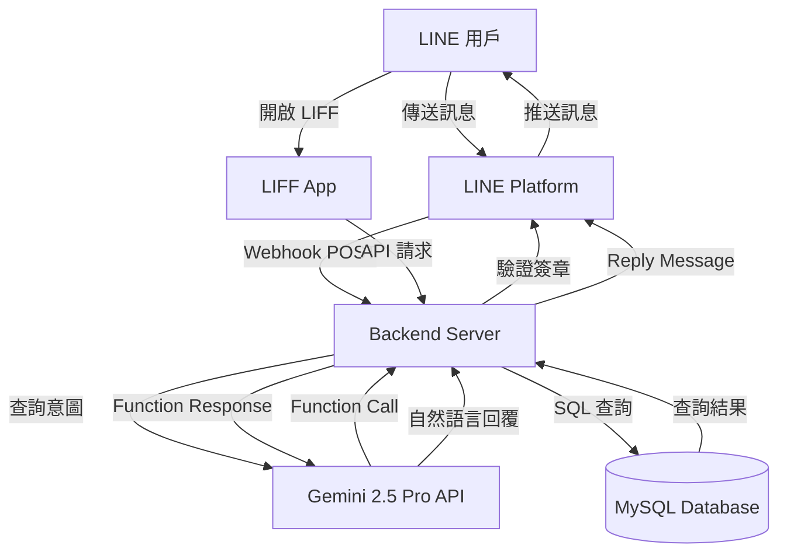
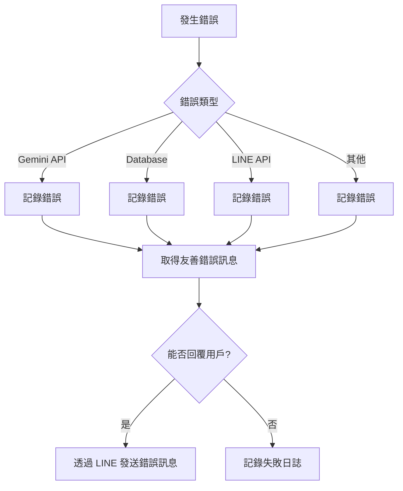

# 設計文檔

## 概述

本系統採用後端-前端分離架構，建立一個整合 LINE Messaging API 與 Google Gemini 2.5 Pro 的智能書庫查詢機器人。後端負責接收 LINE Webhook 事件、與 Gemini API 互動、查詢 MySQL 資料庫，並透過 LINE API 回覆用戶。前端提供可選的 LIFF 網頁介面，用於展示詳細資訊。

## 架構

### 系統架構圖



### 技術棧

**後端 (Backend Server):**
- 語言：Node.js 18+ with TypeScript
- 框架：Express.js 4.x
- LINE SDK：@line/bot-sdk ^8.0.0
- Gemini SDK：@google/generative-ai ^0.2.0
- 資料庫：mysql2 ^3.0.0
- 環境變數：dotenv ^16.0.0
- 部署平台：Google Cloud Run / Vercel

**前端 (LIFF App - 可選):**
- 框架：React 18+ with TypeScript
- LIFF SDK：@line/liff ^2.23.0
- 建置工具：Vite 5.x
- 部署平台：Vercel / Netlify

## 組件與介面

### 1. Webhook Handler (webhookHandler.ts)

**職責：** 接收並處理來自 LINE 平台的 Webhook 事件

**介面：**
```typescript
interface WebhookHandler {
  handleWebhook(req: Request, res: Response): Promise<void>;
  validateSignature(body: string, signature: string): boolean;
  processMessage(event: MessageEvent): Promise<void>;
}
```

**關鍵方法：**
- `handleWebhook`: Express 路由處理器，接收 POST /webhook 請求
- `validateSignature`: 使用 Channel Secret 驗證 X-Line-Signature 標頭
- `processMessage`: 解析訊息事件並分派處理

**相關需求：** 1.1, 1.2, 1.3, 1.4, 1.5

### 2. Gemini Service (geminiService.ts)

**職責：** 與 Google Gemini API 互動，處理自然語言理解和 Function Calling

**介面：**
```typescript
interface GeminiService {
  processUserQuery(userMessage: string): Promise<string>;
  handleFunctionCall(functionCall: FunctionCall): Promise<FunctionResponse>;
  generateFinalResponse(functionResult: string): Promise<string>;
}

interface FunctionCall {
  name: string;
  args: Record<string, any>;
}

interface FunctionResponse {
  name: string;
  response: string;
}
```

**Function Calling 定義：**
```typescript
const searchBooksInDatabase = {
  name: "searchBooksInDatabase",
  description: "在書庫資料庫中搜尋書籍，支援書名、作者、關鍵字查詢",
  parameters: {
    type: "object",
    properties: {
      query: {
        type: "string",
        description: "搜尋關鍵字，可以是書名、作者名或相關主題"
      },
      limit: {
        type: "number",
        description: "最多回傳幾筆結果，預設 10",
        default: 10
      }
    },
    required: ["query"]
  }
};
```

**System Instruction：**
```
你是一個友善且專業的書庫助理。當用戶詢問書籍相關問題時，你會使用 searchBooksInDatabase 函式查詢資料庫。
查詢結果會以 JSON 格式提供給你，請將其轉換為自然、易讀的中文回覆。
如果找到多本書，請列出書名和作者。如果沒有找到，請禮貌地告知用戶並建議其他查詢方式。
保持回覆簡潔，不超過 200 字。
```

**相關需求：** 2.1, 2.2, 2.3, 2.4, 2.5, 4.1, 4.2, 4.3, 4.4

### 3. Database Service (databaseService.ts)

**職責：** 執行 MySQL 資料庫查詢操作

**介面：**
```typescript
interface DatabaseService {
  searchBooks(query: string, limit: number): Promise<Book[]>;
  getBookById(bookId: number): Promise<Book | null>;
  closeConnection(): Promise<void>;
}

interface Book {
  book_id: number;
  title: string;
  quantity: number;
  shelf_location: string;
  library_branch: string;
}
```

**SQL 查詢策略：**
```sql
SELECT book_id, title, quantity, shelf_location, library_branch
FROM books
WHERE title LIKE ?
LIMIT ?
```

**連線池配置：**
```typescript
const poolConfig = {
  host: process.env.DB_HOST,
  port: parseInt(process.env.DB_PORT || '3306'),
  user: process.env.DB_USER,
  password: process.env.DB_PASSWORD,
  database: process.env.DB_NAME,
  waitForConnections: true,
  connectionLimit: 10,
  queueLimit: 0
};
```

**相關需求：** 3.1, 3.2, 3.3, 3.4, 3.5

### 4. LINE Messaging Service (lineMessagingService.ts)

**職責：** 透過 LINE Messaging API 發送訊息給用戶

**介面：**
```typescript
interface LineMessagingService {
  replyMessage(replyToken: string, messages: Message[]): Promise<void>;
  sendTextMessage(replyToken: string, text: string): Promise<void>;
  sendCarouselMessage(replyToken: string, books: Book[]): Promise<void>;
}

type Message = TextMessage | TemplateMessage;
```

**訊息格式策略：**
- 1-2 本書：使用 TextMessage 搭配換行格式
- 3-10 本書：使用 Carousel Template，每本書一個卡片
- 無結果：使用 TextMessage 提供建議

**Carousel Template 範例：**
```typescript
{
  type: 'template',
  altText: '書籍查詢結果',
  template: {
    type: 'carousel',
    columns: books.map(book => ({
      title: book.title.substring(0, 40),
      text: `館藏地：${book.library_branch}\n位置：${book.shelf_location}\n庫存：${book.quantity} 本`,
      actions: [
        {
          type: 'uri',
          label: '查看詳情',
          uri: `${LIFF_URL}?bookId=${book.book_id}`
        }
      ]
    }))
  }
}
```

**相關需求：** 5.1, 5.2, 5.3, 5.4, 5.5

### 5. Error Handler (errorHandler.ts)

**職責：** 統一處理錯誤並記錄日誌

**介面：**
```typescript
interface ErrorHandler {
  handleError(error: Error, context: ErrorContext): Promise<string>;
  logError(error: Error, context: ErrorContext): void;
}

interface ErrorContext {
  userId?: string;
  userMessage?: string;
  operation: string;
}

enum ErrorType {
  GEMINI_API_ERROR = 'GEMINI_API_ERROR',
  DATABASE_ERROR = 'DATABASE_ERROR',
  LINE_API_ERROR = 'LINE_API_ERROR',
  VALIDATION_ERROR = 'VALIDATION_ERROR',
  UNKNOWN_ERROR = 'UNKNOWN_ERROR'
}
```

**錯誤回覆訊息對應：**
```typescript
const errorMessages = {
  GEMINI_API_ERROR: '抱歉，AI 助理暫時無法回應，請稍後再試。',
  DATABASE_ERROR: '書庫系統維護中，請稍後再試。',
  LINE_API_ERROR: '訊息發送失敗，請重新傳送您的問題。',
  VALIDATION_ERROR: '您的訊息格式有誤，請重新輸入。',
  UNKNOWN_ERROR: '系統發生錯誤，我們正在處理中。'
};
```

**相關需求：** 6.1, 6.2, 6.3, 6.4, 6.5

### 6. Configuration Manager (config.ts)

**職責：** 管理環境變數和系統配置

**介面：**
```typescript
interface Config {
  line: LineConfig;
  gemini: GeminiConfig;
  database: DatabaseConfig;
  server: ServerConfig;
  liff?: LiffConfig;
}

interface LineConfig {
  channelSecret: string;
  channelAccessToken: string;
}

interface GeminiConfig {
  apiKey: string;
  model: string;
  maxOutputTokens: number;
  temperature: number;
}

interface DatabaseConfig {
  host: string;
  port: number;
  user: string;
  password: string;
  database: string;
}
```

**環境變數清單：**
```
# LINE Configuration
LINE_CHANNEL_SECRET=your_channel_secret
LINE_CHANNEL_ACCESS_TOKEN=your_access_token

# Gemini Configuration
GEMINI_API_KEY=your_gemini_api_key
GEMINI_MODEL=gemini-2.5-pro

# Database Configuration
DB_HOST=localhost
DB_PORT=3306
DB_USER=bookdb_user
DB_PASSWORD=your_db_password
DB_NAME=book_library

# Server Configuration
PORT=3000
NODE_ENV=production

# LIFF Configuration (Optional)
LIFF_ID=your_liff_id
LIFF_URL=https://liff.line.me/your_liff_id
```

**相關需求：** 7.1, 7.2, 7.3, 7.4, 7.5

### 7. LIFF App (可選)

**職責：** 提供網頁介面展示書籍詳情和使用指南

**主要頁面：**
- `/` - 首頁/使用指南
- `/book/:id` - 書籍詳情頁
- `/about` - 關於頁面

**React 組件結構：**
```
src/
├── App.tsx
├── pages/
│   ├── Home.tsx
│   ├── BookDetail.tsx
│   └── About.tsx
├── components/
│   ├── BookCard.tsx
│   └── Header.tsx
├── services/
│   ├── liffService.ts
│   └── apiService.ts
└── types/
    └── book.ts
```

**LIFF 初始化：**
```typescript
async function initializeLiff() {
  await liff.init({ liffId: import.meta.env.VITE_LIFF_ID });
  
  if (!liff.isLoggedIn()) {
    liff.login();
  }
  
  const profile = await liff.getProfile();
  return profile;
}
```

**相關需求：** 8.1, 8.2, 8.3, 8.4, 8.5

## 資料模型

### Book (書籍)

```typescript
interface Book {
  book_id: number;         // 書籍唯一識別碼 (Primary Key)
  title: string;           // 書名
  quantity: number;        // 目前的庫存數量
  shelf_location: string;  // 存放位置或書架號
  library_branch: string;  // 所在的分館或館藏地
}
```

### MySQL 資料表結構

**注意：此為現有資料庫結構，請勿修改**

```sql
-- 現有資料表結構
-- 資料表名稱: books
-- 欄位:
--   book_id: 書籍的唯一ID (Primary Key)
--   title: 書名
--   quantity: 目前的庫存數量
--   shelf_location: 存放位置或書架號
--   library_branch: 所在的分館或館藏地
```

## 錯誤處理

### 錯誤處理流程



### 重試策略

**Gemini API：**
- 最多重試 2 次
- 指數退避：1 秒、2 秒
- 超時時間：10 秒

**Database：**
- 最多重試 3 次
- 固定間隔：500 毫秒
- 超時時間：5 秒

**LINE API：**
- 最多重試 2 次
- 固定間隔：1 秒
- 超時時間：5 秒

## 測試策略

### 單元測試

**測試框架：** Jest + ts-jest

**測試範圍：**
- `geminiService.ts`: 測試 Function Calling 解析和回應生成
- `databaseService.ts`: 測試 SQL 查詢邏輯（使用 mock 資料庫）
- `lineMessagingService.ts`: 測試訊息格式轉換
- `errorHandler.ts`: 測試錯誤分類和訊息對應

**測試覆蓋率目標：** 80%

### 整合測試

**測試場景：**
1. 完整的用戶查詢流程（Webhook → Gemini → Database → LINE）
2. Gemini Function Calling 與資料庫查詢的整合
3. 錯誤情況下的降級處理

**測試工具：** Supertest + nock (模擬外部 API)

### 端對端測試

**測試場景：**
1. 用戶在 LINE 中傳送「有沒有金剛經相關的書」
2. 系統回覆包含書籍清單的 Carousel 訊息
3. 用戶點擊「查看詳情」開啟 LIFF 頁面

**測試工具：** Playwright (模擬 LINE 環境)

### 手動測試檢查清單

- [ ] LINE Webhook 簽章驗證
- [ ] Gemini Function Calling 正確觸發
- [ ] 資料庫查詢回傳正確結果
- [ ] Carousel 訊息在 LINE 中正確顯示
- [ ] LIFF 頁面在 LINE 中正常載入
- [ ] 錯誤訊息友善且有幫助
- [ ] 環境變數正確載入
- [ ] 日誌記錄完整且不包含敏感資訊

## 部署架構

### 後端部署 (Google Cloud Run)

```yaml
# cloudbuild.yaml
steps:
  - name: 'gcr.io/cloud-builders/docker'
    args: ['build', '-t', 'gcr.io/$PROJECT_ID/line-book-bot', '.']
  - name: 'gcr.io/cloud-builders/docker'
    args: ['push', 'gcr.io/$PROJECT_ID/line-book-bot']
  - name: 'gcr.io/google.com/cloudsdktool/cloud-sdk'
    entrypoint: gcloud
    args:
      - 'run'
      - 'deploy'
      - 'line-book-bot'
      - '--image'
      - 'gcr.io/$PROJECT_ID/line-book-bot'
      - '--region'
      - 'asia-east1'
      - '--platform'
      - 'managed'
```

**環境變數設定：**
```bash
gcloud run services update line-book-bot \
  --set-env-vars="LINE_CHANNEL_SECRET=xxx,LINE_CHANNEL_ACCESS_TOKEN=xxx,GEMINI_API_KEY=xxx" \
  --set-secrets="DB_PASSWORD=db-password:latest"
```

### 前端部署 (Vercel)

```json
{
  "buildCommand": "npm run build",
  "outputDirectory": "dist",
  "env": {
    "VITE_LIFF_ID": "@liff-id",
    "VITE_API_URL": "@api-url"
  }
}
```

### 資料庫部署

**選項 1：Google Cloud SQL (推薦)**
- 自動備份
- 高可用性配置
- 私有 IP 連線

**選項 2：自架 MySQL**
- 需要手動管理備份
- 需要設定防火牆規則
- 成本較低

## 安全性考量

1. **API 金鑰保護：** 所有敏感資訊儲存在環境變數或 Secret Manager
2. **Webhook 驗證：** 每次請求都驗證 LINE 簽章
3. **SQL 注入防護：** 使用參數化查詢
4. **HTTPS：** 所有通訊都透過 HTTPS
5. **CORS：** 限制 LIFF App 的來源
6. **日誌脫敏：** 不記錄用戶個人資訊或 API 金鑰
7. **速率限制：** 防止 API 濫用（每用戶每分鐘 10 次請求）

## 效能優化

1. **資料庫連線池：** 重用資料庫連線
2. **Gemini API 快取：** 相同查詢在 5 分鐘內回傳快取結果
3. **非同步處理：** 所有 I/O 操作使用 async/await
4. **訊息批次處理：** 多個用戶同時查詢時批次處理
5. **CDN：** LIFF App 靜態資源透過 CDN 分發

## 監控與日誌

**日誌層級：**
- ERROR: 系統錯誤、API 失敗
- WARN: 重試、降級處理
- INFO: 用戶查詢、回覆發送
- DEBUG: 詳細的 API 請求/回應

**監控指標：**
- Webhook 請求數量和延遲
- Gemini API 呼叫成功率
- 資料庫查詢時間
- LINE API 回覆成功率
- 錯誤發生頻率

**工具：**
- Google Cloud Logging
- Google Cloud Monitoring
- Sentry (錯誤追蹤)
