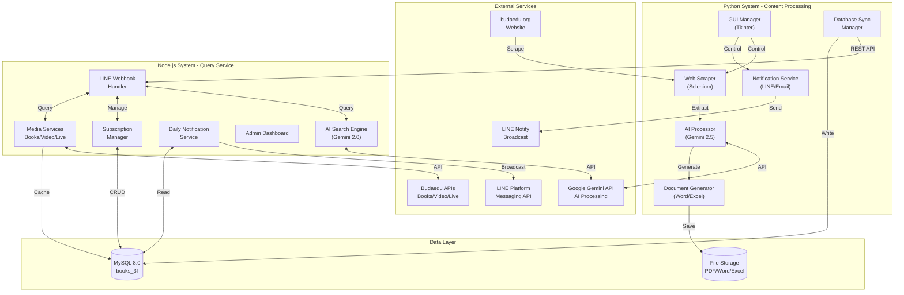
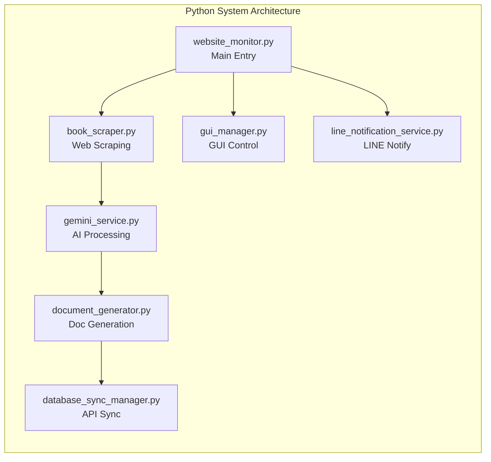
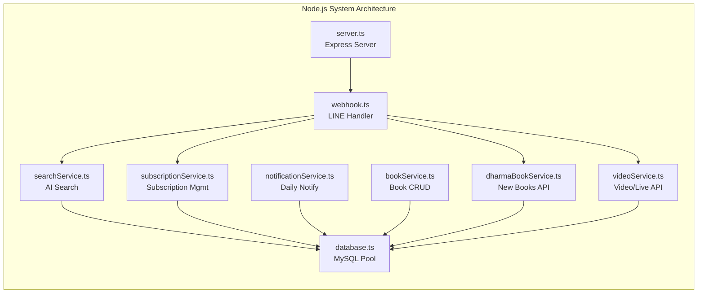
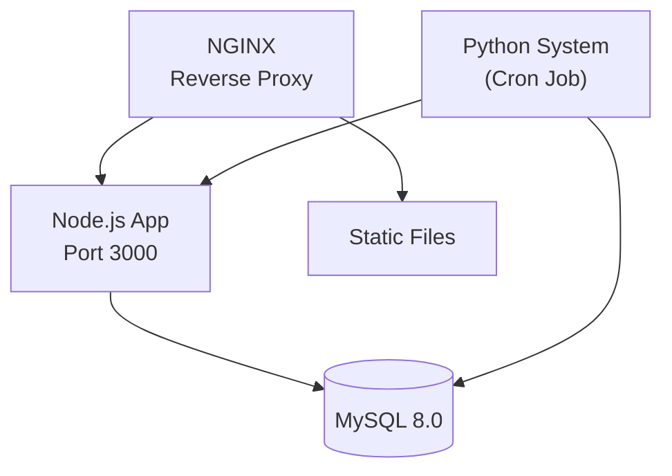

# System Architecture Document
# 佛教教育系統 - Buddhist Education System

**版本**: 1.0  
**最後更新**: 2025-11-21  
**架構師**: System Architect Team

---

## 1. Architecture Overview

### 1.1 System Vision

佛教教育系統採用雙系統架構,結合Python的強大爬蟲與文件處理能力,以及Node.js的高效能API服務,為佛教教育機構提供完整的內容管理和智能查詢解決方案。

### 1.2 High-Level Architecture



### 1.3 Design Principles

1. **責任分離 (Separation of Concerns)**
   - Python系統專注於內容處理和批次作業
   - Node.js系統專注於即時查詢和用戶互動

2. **鬆耦合 (Loose Coupling)**
   - 系統間透過REST API和共享資料庫通訊
   - 服務可獨立部署和擴展

3. **高可用性 (High Availability)**
   - 錯誤處理和自動重試機制
   - 健康檢查和監控

4. **安全優先 (Security First)**
   - API金鑰加密存儲
   - 輸入驗證和SQL注入防護
   - HTTPS加密傳輸

---

## 2. Technical Architecture

### 2.1 Technology Stack

#### Python System (ebook)

| Layer | Technology | Purpose |
|-------|-----------|---------|
| **Language** | Python 3.8+ | 核心語言 |
| **Web Scraping** | Selenium 4.0+ | 動態網頁爬取 |
| **AI Processing** | Google Gemini Pro 2.5 | 內容摘要與分析 |
| **PDF Processing** | pypdf, PyPDF2 | PDF文字提取 |
| **Document Generation** | python-docx, openpyxl | Word/Excel生成 |
| **GUI** | Tkinter | 系統管理介面 |
| **HTTP Client** | requests, aiohttp | API調用 |
| **Notification** | LINE Notify API | 推播通知 |

#### Node.js System (Line-bot-llm-mysql)

| Layer | Technology | Purpose |
|-------|-----------|---------|
| **Runtime** | Node.js 18+ | 執行環境 |
| **Language** | TypeScript 5.0+ | 型別安全 |
| **Framework** | Express.js | Web API框架 |
| **Database ORM** | mysql2 | MySQL連接 |
| **LINE Integration** | @line/bot-sdk | LINE Bot開發 |
| **AI Integration** | @google/generative-ai | Gemini AI查詢 |
| **Scheduling** | node-cron | 定時任務 |
| **Validation** | Joi, express-validator | 輸入驗證 |

#### Shared Infrastructure

| Component | Technology | Purpose |
|-----------|-----------|---------|
| **Database** | MySQL 8.0 | 持久化存儲 |
| **Browser Driver** | ChromeDriver | Selenium驅動 |
| **Version Control** | Git | 代碼管理 |
| **Containerization** | Docker (optional) | 部署容器化 |

### 2.2 System Components

#### 2.2.1 Python System Modules



**模組職責**:

- **website_monitor.py**: 主控制器,協調所有模組
- **book_scraper.py**: 網站爬取,動態內容載入
- **gemini_service.py**: AI摘要生成,內容分析
- **document_generator.py**: Word/Excel文件生成
- **database_sync_manager.py**: 資料同步到Node.js API
- **line_notification_service.py**: LINE推播通知
- **gui_manager.py**: Tkinter管理介面

#### 2.2.2 Node.js System Modules



**模組職責**:

- **server.ts**: Express應用主入口,路由配置
- **webhook.ts**: LINE webhook處理,訊息分發
- **searchService.ts**: 智能書籍搜尋,Gemini整合
- **subscriptionService.ts**: 訂閱管理,用戶狀態
- **notificationService.ts**: 每日通知發送,排程任務
- **bookService.ts**: 書籍資料CRUD操作
- **database.ts**: MySQL連接池管理
- **dharmaBookService.ts**: 最新法寶API整合 (Budaedu API)
- **videoService.ts**: 影音與直播API整合 (Budaedu API)

---

## 3. API Interface Design

### 3.1 Python → Node.js API

Python系統透過REST API將處理結果同步到Node.js系統。

#### 3.1.1 Sync Books Data

```http
POST /api/sync/books
Content-Type: application/json
Authorization: Bearer {API_KEY}

{
  "books": [
    {
      "title": "佛學入門",
      "author": "釋證嚴",
      "category": "佛學基礎",
      "publishDate": "2025-01-15",
      "pdfUrl": "https://example.com/books/001.pdf",
      "summary": "本書介紹佛學基本概念...",
      "coverImage": "https://example.com/covers/001.jpg"
    }
  ],
  "syncTimestamp": "2025-11-21T10:00:00Z"
}
```

**Response**:
```json
{
  "success": true,
  "message": "Successfully synced 5 books",
  "syncedCount": 5,
  "failedCount": 0,
  "errors": []
}
```

#### 3.1.2 Sync Announcements

```http
POST /api/sync/announcements
Content-Type: application/json
Authorization: Bearer {API_KEY}

{
  "announcements": [
    {
      "title": "停課通知",
      "content": "本週六因場地維修停課一次",
      "type": "CANCELLATION",
      "publishDate": "2025-11-20",
      "priority": "HIGH"
    }
  ]
}
```

### 3.2 LINE Bot API

#### 3.2.1 Webhook Endpoint

```http
POST /webhook
X-Line-Signature: {signature}
Content-Type: application/json

{
  "events": [
    {
      "type": "message",
      "message": {
        "type": "text",
        "text": "查詢 佛學入門"
      },
      "replyToken": "xxx",
      "source": {
        "userId": "U123456789"
      }
    }
  ]
}
```

#### 3.2.2 Search Books API

```http
GET /api/books/search?q=佛學入門&limit=5
Authorization: Bearer {API_KEY}

Response:
{
  "results": [
    {
      "id": 1,
      "title": "佛學入門",
      "author": "釋證嚴",
      "category": "佛學基礎",
      "summary": "本書介紹...",
      "pdfUrl": "https://...",
      "relevanceScore": 0.95
    }
  ],
  "total": 1,
  "page": 1,
  "limit": 5
}
```

#### 3.2.3 Subscription Management API

```http
POST /api/subscription/subscribe
Content-Type: application/json

{
  "userId": "U123456789",
  "username": "使用者名稱",
  "notificationTypes": ["NEW_BOOKS", "ANNOUNCEMENTS"]
}

Response:
{
  "success": true,
  "message": "訂閱成功",
  "subscription": {
    "userId": "U123456789",
    "status": "ACTIVE",
    "createdAt": "2025-11-21T10:30:00Z"
  }
}
```

### 3.3 Admin API

#### 3.3.1 Health Check

```http
GET /health

Response:
{
  "status": "healthy",
  "timestamp": "2025-11-21T10:00:00Z",
  "services": {
    "database": "connected",
    "lineApi": "operational",
    "geminiApi": "operational"
  },
  "uptime": 86400
}
```

#### 3.3.2 Statistics API

```http
GET /api/admin/statistics
Authorization: Bearer {ADMIN_TOKEN}

Response:
{
  "totalBooks": 1250,
  "totalSubscribers": 853,
  "activeUsers": 127,
  "todayNotifications": 853,
  "todayQueries": 342,
  "systemUptime": "99.7%"
}
```

### 3.4 API Security

#### Authentication & Authorization

```typescript
// API Key驗證中間件
const apiKeyAuth = (req, res, next) => {
  const apiKey = req.headers['authorization']?.replace('Bearer ', '');
  
  if (!apiKey || !validateApiKey(apiKey)) {
    return res.status(401).json({
      error: 'Unauthorized',
      message: 'Invalid or missing API key'
    });
  }
  
  next();
};

// LINE Signature驗證
const lineSignatureAuth = (req, res, next) => {
  const signature = req.headers['x-line-signature'];
  const body = JSON.stringify(req.body);
  
  if (!validateLineSignature(signature, body, channelSecret)) {
    return res.status(401).json({
      error: 'Invalid signature'
    });
  }
  
  next();
};
```

#### Rate Limiting

```typescript
// 設定速率限制
const rateLimiter = rateLimit({
  windowMs: 60 * 1000, // 1分鐘
  max: 100, // 最多100次請求
  message: 'Too many requests from this IP'
});

app.use('/api/', rateLimiter);
```

---

## 4. Database Schema Design

### 4.1 Database: books_3f

#### 4.1.1 books Table

```sql
CREATE TABLE books (
    id INT AUTO_INCREMENT PRIMARY KEY,
    title VARCHAR(255) NOT NULL,
    author VARCHAR(255),
    category VARCHAR(100),
    publish_date DATE,
    pdf_url VARCHAR(500),
    cover_image VARCHAR(500),
    summary TEXT,
    full_content LONGTEXT,
    page_count INT,
    file_size BIGINT,
    isbn VARCHAR(20),
    tags JSON,
    created_at TIMESTAMP DEFAULT CURRENT_TIMESTAMP,
    updated_at TIMESTAMP DEFAULT CURRENT_TIMESTAMP ON UPDATE CURRENT_TIMESTAMP,
    is_active BOOLEAN DEFAULT TRUE,
    
    INDEX idx_title (title),
    INDEX idx_author (author),
    INDEX idx_category (category),
    INDEX idx_publish_date (publish_date),
    FULLTEXT INDEX ft_title_content (title, summary)
) ENGINE=InnoDB DEFAULT CHARSET=utf8mb4 COLLATE=utf8mb4_unicode_ci;
```

**欄位說明**:
- `id`: 主鍵,自動遞增
- `title`: 書名,必填
- `author`: 作者
- `category`: 分類
- `publish_date`: 出版日期
- `pdf_url`: PDF下載連結
- `summary`: AI生成摘要
- `full_content`: 完整內容(用於全文搜尋)
- `tags`: JSON格式標籤
- `is_active`: 是否啟用狀態

#### 4.1.2 subscriptions Table

```sql
CREATE TABLE subscriptions (
    id INT AUTO_INCREMENT PRIMARY KEY,
    user_id VARCHAR(100) UNIQUE NOT NULL,
    username VARCHAR(255),
    display_name VARCHAR(255),
    status ENUM('ACTIVE', 'INACTIVE', 'SUSPENDED') DEFAULT 'ACTIVE',
    notification_types JSON,
    subscribed_at TIMESTAMP DEFAULT CURRENT_TIMESTAMP,
    last_notified_at TIMESTAMP NULL,
    notification_count INT DEFAULT 0,
    created_at TIMESTAMP DEFAULT CURRENT_TIMESTAMP,
    updated_at TIMESTAMP DEFAULT CURRENT_TIMESTAMP ON UPDATE CURRENT_TIMESTAMP,
    
    INDEX idx_user_id (user_id),
    INDEX idx_status (status),
    INDEX idx_subscribed_at (subscribed_at)
) ENGINE=InnoDB DEFAULT CHARSET=utf8mb4 COLLATE=utf8mb4_unicode_ci;
```

**欄位說明**:
- `user_id`: LINE用戶ID,唯一
- `status`: 訂閱狀態
- `notification_types`: 訂閱通知類型 (JSON)
- `last_notified_at`: 上次通知時間
- `notification_count`: 累計通知次數

#### 4.1.3 announcements Table

```sql
CREATE TABLE announcements (
    id INT AUTO_INCREMENT PRIMARY KEY,
    title VARCHAR(255) NOT NULL,
    content TEXT NOT NULL,
    type ENUM('NEWS', 'CANCELLATION', 'GENERAL') DEFAULT 'GENERAL',
    priority ENUM('LOW', 'MEDIUM', 'HIGH', 'URGENT') DEFAULT 'MEDIUM',
    publish_date DATE,
    expire_date DATE,
    is_published BOOLEAN DEFAULT TRUE,
    created_at TIMESTAMP DEFAULT CURRENT_TIMESTAMP,
    updated_at TIMESTAMP DEFAULT CURRENT_TIMESTAMP ON UPDATE CURRENT_TIMESTAMP,
    
    INDEX idx_type (type),
    INDEX idx_priority (priority),
    INDEX idx_publish_date (publish_date),
    INDEX idx_is_published (is_published)
) ENGINE=InnoDB DEFAULT CHARSET=utf8mb4 COLLATE=utf8mb4_unicode_ci;
```

#### 4.1.4 notification_logs Table

```sql
CREATE TABLE notification_logs (
    id BIGINT AUTO_INCREMENT PRIMARY KEY,
    user_id VARCHAR(100) NOT NULL,
    notification_type ENUM('NEW_BOOK', 'ANNOUNCEMENT', 'CANCELLATION', 'SYSTEM') NOT NULL,
    content_id INT,
    message_content TEXT,
    delivery_status ENUM('PENDING', 'SENT', 'FAILED', 'RETRYING') DEFAULT 'PENDING',
    sent_at TIMESTAMP NULL,
    error_message TEXT,
    retry_count INT DEFAULT 0,
    created_at TIMESTAMP DEFAULT CURRENT_TIMESTAMP,
    
    INDEX idx_user_id (user_id),
    INDEX idx_delivery_status (delivery_status),
    INDEX idx_sent_at (sent_at),
    FOREIGN KEY (user_id) REFERENCES subscriptions(user_id) ON DELETE CASCADE
) ENGINE=InnoDB DEFAULT CHARSET=utf8mb4 COLLATE=utf8mb4_unicode_ci;
```

#### 4.1.5 query_logs Table

```sql
CREATE TABLE query_logs (
    id BIGINT AUTO_INCREMENT PRIMARY KEY,
    user_id VARCHAR(100) NOT NULL,
    query_text TEXT NOT NULL,
    query_type ENUM('SEARCH', 'RECOMMENDATION', 'INFO') DEFAULT 'SEARCH',
    results_count INT DEFAULT 0,
    response_time_ms INT,
    is_successful BOOLEAN DEFAULT TRUE,
    created_at TIMESTAMP DEFAULT CURRENT_TIMESTAMP,
    
    INDEX idx_user_id (user_id),
    INDEX idx_created_at (created_at),
    INDEX idx_query_type (query_type)
) ENGINE=InnoDB DEFAULT CHARSET=utf8mb4 COLLATE=utf8mb4_unicode_ci;
```

### 4.2 Database Indexing Strategy

#### 4.2.1 Primary Indexes

所有表格使用自動遞增INT/BIGINT作為主鍵,確保高效能插入和查詢。

#### 4.2.2 Foreign Key Indexes

- `notification_logs.user_id` → `subscriptions.user_id` (CASCADE DELETE)

#### 4.2.3 Composite Indexes

```sql
-- 書籍複合查詢
CREATE INDEX idx_book_category_date ON books(category, publish_date DESC);

-- 訂閱用戶狀態查詢
CREATE INDEX idx_subscription_status_date ON subscriptions(status, subscribed_at DESC);
```

#### 4.2.4 Full-Text Search

```sql
-- 書籍全文搜尋
ALTER TABLE books ADD FULLTEXT INDEX ft_search (title, author, summary);

-- 查詢範例
SELECT * FROM books 
WHERE MATCH(title, author, summary) AGAINST ('佛學 入門' IN NATURAL LANGUAGE MODE)
LIMIT 10;
```

### 4.3 Data Integrity

#### 4.3.1 Constraints

```sql
-- 確保訂閱狀態有效
ALTER TABLE subscriptions 
ADD CONSTRAINT chk_status 
CHECK (status IN ('ACTIVE', 'INACTIVE', 'SUSPENDED'));

-- 確保優先級有效
ALTER TABLE announcements 
ADD CONSTRAINT chk_priority 
CHECK (priority IN ('LOW', 'MEDIUM', 'HIGH', 'URGENT'));
```

#### 4.3.2 Triggers

```sql
-- 更新訂閱用戶最後通知時間
DELIMITER $$
CREATE TRIGGER update_last_notified
AFTER INSERT ON notification_logs
FOR EACH ROW
BEGIN
    IF NEW.delivery_status = 'SENT' THEN
        UPDATE subscriptions 
        SET last_notified_at = NEW.sent_at,
            notification_count = notification_count + 1
        WHERE user_id = NEW.user_id;
    END IF;
END$$
DELIMITER ;
```

### 4.4 Database Backup Strategy

```bash
# 每日自動備份
0 2 * * * mysqldump -u root -p books_3f > /backup/books_3f_$(date +\%Y\%m\%d).sql

# 保留最近30天備份
find /backup -name "books_3f_*.sql" -mtime +30 -delete
```

---

## 5. Module Responsibilities

### 5.1 Python System Modules

#### 5.1.1 website_monitor.py

**責任**:
- 主程序入口點
- 協調所有子模組執行
- 排程任務控制
- 錯誤處理和重試邏輯

**依賴**:
- book_scraper
- gemini_service
- document_generator
- database_sync_manager
- line_notification_service

**安全考量**:
- 環境變數加密讀取
- 異常捕獲不暴露敏感資訊
- 日誌脫敏處理

#### 5.1.2 book_scraper.py

**責任**:
- 網站內容爬取
- 動態JavaScript渲染處理
- PDF檔案下載
- 資料結構化解析

**依賴**:
- Selenium WebDriver
- ChromeDriver

**安全考量**:
- User-Agent輪換
- 請求頻率限制(避免被封禁)
- SSL憑證驗證

#### 5.1.3 gemini_service.py

**責任**:
- Google Gemini API整合
- PDF文字提取
- AI摘要生成
- 錯誤重試機制

**依賴**:
- google.generativeai
- pypdf

**安全考量**:
- API Key環境變數存儲
- 請求內容過濾(避免洩漏敏感資訊)
- API配額監控

#### 5.1.4 database_sync_manager.py

**責任**:
- 呼叫Node.js REST API同步資料
- 批次資料傳輸
- 同步失敗重試
- 狀態追蹤

**依賴**:
- requests/aiohttp
- Node.js API endpoint

**安全考量**:
- HTTPS加密傳輸
- API Key驗證
- 輸入資料驗證和清理

#### 5.1.5 line_notification_service.py

**責任**:
- LINE Notify訊息發送
- 訊息格式化
- 發送狀態追蹤

**依賴**:
- LINE Notify API

**安全考量**:
- Access Token加密存儲
- 訊息內容過濾
- 發送速率控制

### 5.2 Node.js System Modules

#### 5.2.1 server.ts

**責任**:
- Express應用初始化
- 路由配置
- 中間件設定
- 錯誤處理

**安全考量**:
- CORS設定
- Helmet安全頭
- Body parser限制大小
- Rate limiting

#### 5.2.2 webhook.ts

**責任**:
- LINE webhook事件處理
- 訊息類型分發
- Reply Token管理
- 用戶行為分析

**依賴**:
- @line/bot-sdk
- searchService
- subscriptionService

**安全考量**:
- LINE Signature驗證
- Replay attack防護
- 輸入驗證

#### 5.2.3 searchService.ts

**責任**:
- 書籍智能搜尋
- Gemini AI查詢
- 結果排序和過濾
- 相關推薦

**依賴**:
- @google/generative-ai
- MySQL書籍資料

**安全考量**:
- SQL注入防護(使用參數化查詢)
- 查詢結果限制
- API配額管理

#### 5.2.4 subscriptionService.ts

**責任**:
- 訂閱狀態管理
- 用戶CRUD操作
- 訂閱驗證
- 資料持久化

**依賴**:
- MySQL subscriptions表

**安全考量**:
- 用戶資料加密
- 防止重複訂閱
- 防止重複訂閱
- 資料完整性驗證

#### 5.2.6 dharmaBookService.ts (New)

**責任**:
- 整合 `dharma/public/api/books/chinese` API
- 獲取最新法寶資料
- 實作快取策略 (5分鐘)
- 資料格式轉換為Flex Message

**依賴**:
- axios (HTTP Client)
- node-cache

**安全考量**:
- API回應驗證
- 錯誤處理與降級機制

#### 5.2.7 videoService.ts (New)

**責任**:
- 整合 `laravel/public/api/courses` (直播)
- 整合 `audiovisual/public/api/series` (影音)
- 判斷當日直播狀態
- 獲取最新影音課程
- 實作快取策略 (1-10分鐘)

**依賴**:
- axios
- node-cache

**安全考量**:
- 處理跨來源資源共享(CORS)
- 確保HLS串流URL安全性

#### 5.2.5 notificationService.ts

**責任**:
- 每日定時通知
- 批量訊息發送
- 失敗重試
- 發送記錄

**依賴**:
- @line/bot-sdk
- node-cron
- MySQL

**安全考量**:
- 發送速率限制(符合LINE API限制)
- 失敗處理不洩漏用戶資訊
- 日誌記錄脫敏

---

## 6. Security Considerations

### 6.1 Authentication & Authorization

#### 6.1.1 API Key Management

```python
# Python: 環境變數加密存儲
import os
from cryptography.fernet import Fernet

def load_encrypted_key(key_name):
    cipher_key = os.getenv('CIPHER_KEY')
    encrypted_value = os.getenv(key_name)
    
    f = Fernet(cipher_key.encode())
    return f.decrypt(encrypted_value.encode()).decode()

GEMINI_API_KEY = load_encrypted_key('GEMINI_API_KEY_ENC')
```

```typescript
// Node.js: 環境變數驗證
import dotenv from 'dotenv';
import Joi from 'joi';

dotenv.config();

const envSchema = Joi.object({
  CHANNEL_ACCESS_TOKEN: Joi.string().required(),
  CHANNEL_SECRET: Joi.string().required(),
  GEMINI_API_KEY: Joi.string().required(),
  DATABASE_PASSWORD: Joi.string().required()
}).unknown();

const { error } = envSchema.validate(process.env);
if (error) {
  throw new Error(`Config validation error: ${error.message}`);
}
```

#### 6.1.2 LINE Signature Verification

```typescript
import crypto from 'crypto';

function validateLineSignature(
  signature: string, 
  body: string, 
  secret: string
): boolean {
  const hash = crypto
    .createHmac('SHA256', secret)
    .update(body)
    .digest('base64');
  
  return signature === hash;
}

// 使用
app.post('/webhook', (req, res) => {
  const signature = req.headers['x-line-signature'] as string;
  const body = JSON.stringify(req.body);
  
  if (!validateLineSignature(signature, body, CHANNEL_SECRET)) {
    return res.status(401).json({ error: 'Invalid signature' });
  }
  
  // Process webhook
});
```

### 6.2 Data Protection

#### 6.2.1 SQL Injection Prevention

```typescript
// ❌ 錯誤:字串拼接
const query = `SELECT * FROM books WHERE title = '${userInput}'`;

// ✅ 正確:參數化查詢
const query = 'SELECT * FROM books WHERE title = ?';
const [rows] = await db.execute(query, [userInput]);
```

#### 6.2.2 Input Validation

```typescript
import Joi from 'joi';

const subscriptionSchema = Joi.object({
  userId: Joi.string().pattern(/^U[0-9a-f]{32}$/).required(),
  username: Joi.string().min(1).max(100).required(),
  notificationTypes: Joi.array().items(
    Joi.string().valid('NEW_BOOKS', 'ANNOUNCEMENTS', 'CANCELLATION')
  ).min(1).required()
});

// 驗證
const { error, value } = subscriptionSchema.validate(req.body);
if (error) {
  return res.status(400).json({ 
    error: 'Validation failed', 
    details: error.details 
  });
}
```

#### 6.2.3 XSS Protection

```typescript
import DOMPurify from 'isomorphic-dompurify';

function sanitizeInput(input: string): string {
  return DOMPurify.sanitize(input, {
    ALLOWED_TAGS: [],
    ALLOWED_ATTR: []
  });
}

// 使用
const safeTitle = sanitizeInput(req.body.title);
```

### 6.3 Network Security

#### 6.3.1 HTTPS Enforcement

```typescript
// 強制HTTPS重定向
app.use((req, res, next) => {
  if (req.header('x-forwarded-proto') !== 'https' && 
      process.env.NODE_ENV === 'production') {
    res.redirect(`https://${req.header('host')}${req.url}`);
  } else {
    next();
  }
});
```

#### 6.3.2 CORS Configuration

```typescript
import cors from 'cors';

const corsOptions = {
  origin: (origin, callback) => {
    const whitelist = [
      'https://yourdomain.com',
      'https://admin.yourdomain.com'
    ];
    
    if (!origin || whitelist.indexOf(origin) !== -1) {
      callback(null, true);
    } else {
      callback(new Error('Not allowed by CORS'));
    }
  },
  credentials: true,
  optionsSuccessStatus: 200
};

app.use(cors(corsOptions));
```

#### 6.3.3 Security Headers

```typescript
import helmet from 'helmet';

app.use(helmet({
  contentSecurityPolicy: {
    directives: {
      defaultSrc: ["'self'"],
      styleSrc: ["'self'", "'unsafe-inline'"],
      scriptSrc: ["'self'"],
      imgSrc: ["'self'", "data:", "https:"],
    },
  },
  hsts: {
    maxAge: 31536000,
    includeSubDomains: true,
    preload: true
  }
}));
```

### 6.4 Error Handling

#### 6.4.1 安全錯誤訊息

```typescript
// ❌ 錯誤:洩漏內部資訊
catch (error) {
  res.status(500).json({ 
    error: error.message,
    stack: error.stack 
  });
}

// ✅ 正確:通用錯誤訊息
catch (error) {
  logger.error('Database error:', error);
  res.status(500).json({ 
    error: 'Internal server error',
    requestId: req.id 
  });
}
```

#### 6.4.2 日誌脫敏

```typescript
function sanitizeLog(data: any): any {
  const sensitiveKeys = ['password', 'apiKey', 'token', 'secret'];
  const sanitized = { ...data };
  
  for (const key in sanitized) {
    if (sensitiveKeys.some(k => key.toLowerCase().includes(k))) {
      sanitized[key] = '***REDACTED***';
    }
  }
  
  return sanitized;
}

logger.info('User login', sanitizeLog(userData));
```

### 6.5 Rate Limiting

```typescript
import rateLimit from 'express-rate-limit';
import RedisStore from 'rate-limit-redis';

// API速率限制
const apiLimiter = rateLimit({
  windowMs: 15 * 60 * 1000, // 15分鐘
  max: 100, // 最多100次請求
  standardHeaders: true,
  legacyHeaders: false,
  message: 'Too many requests from this IP',
  // 使用Redis儲存(分散式環境)
  store: new RedisStore({
    client: redisClient,
    prefix: 'rate_limit:'
  })
});

// LINE webhook速率限制(更嚴格)
const webhookLimiter = rateLimit({
  windowMs: 60 * 1000,
  max: 30
});

app.use('/api/', apiLimiter);
app.use('/webhook', webhookLimiter);
```

### 6.6 Secrets Management

#### 6.6.1 環境變數結構

```bash
# .env.example (版本控制)
CHANNEL_ACCESS_TOKEN=your_token_here
CHANNEL_SECRET=your_secret_here
GEMINI_API_KEY=your_api_key_here
DATABASE_HOST=localhost
DATABASE_USER=root
DATABASE_PASSWORD=your_password_here
DATABASE_NAME=books_3f
```

#### 6.6.2 生產環境密鑰管理

```typescript
// 使用專業密鑰管理服務
import { SecretManagerServiceClient } from '@google-cloud/secret-manager';

async function getSecret(secretName: string): Promise<string> {
  const client = new SecretManagerServiceClient();
  const [version] = await client.accessSecretVersion({
    name: `projects/${PROJECT_ID}/secrets/${secretName}/versions/latest`
  });
  
  return version.payload.data.toString();
}

// 或使用AWS Secrets Manager / HashiCorp Vault
```

---

## 7. Deployment Architecture

### 7.1 Deployment Options

#### Option 1: Single Server Deployment



#### Option 2: Docker Deployment

```yaml
# docker-compose.yml
version: '3.8'

services:
  mysql:
    image: mysql:8.0
    environment:
      MYSQL_ROOT_PASSWORD: ${DB_PASSWORD}
      MYSQL_DATABASE: books_3f
    volumes:
      - mysql_data:/var/lib/mysql
    ports:
      - "3306:3306"

  node-app:
    build: ./Line-bot-llm-mysql
    environment:
      DATABASE_HOST: mysql
      NODE_ENV: production
    ports:
      - "3000:3000"
    depends_on:
      - mysql

  python-worker:
    build: ./ebook
    environment:
      DATABASE_HOST: mysql
      NODE_API_URL: http://node-app:3000
    depends_on:
      - mysql
      - node-app

volumes:
  mysql_data:
```

### 7.2 Monitoring & Logging

```typescript
// 健康檢查端點
app.get('/health', async (req, res) => {
  try {
    // 檢查資料庫連接
    await db.ping();
    
    // 檢查外部服務
    const geminiStatus = await checkGeminiApi();
    const lineStatus = await checkLineApi();
    
    res.json({
      status: 'healthy',
      timestamp: new Date().toISOString(),
      services: {
        database: 'connected',
        gemini: geminiStatus,
        line: lineStatus
      },
      uptime: process.uptime()
    });
  } catch (error) {
    res.status(503).json({
      status: 'unhealthy',
      error: 'Service unavailable'
    });
  }
});
```

---

## 8. Appendix

### 8.1 System Configuration

#### Python System Config

```python
# config.py
import os
from dataclasses import dataclass

@dataclass
class Config:
    # Selenium
    CHROME_DRIVER_PATH: str = os.getenv('CHROME_DRIVER_PATH', 'chromedriver')
    HEADLESS: bool = os.getenv('HEADLESS', 'true').lower() == 'true'
    
    # Gemini API
    GEMINI_API_KEY: str = os.getenv('GEMINI_API_KEY')
    GEMINI_MODEL: str = 'gemini-2.5-pro'
    
    # LINE Notify
    LINE_NOTIFY_TOKEN: str = os.getenv('LINE_NOTIFY_TOKEN')
    
    # Node.js API
    NODE_API_URL: str = os.getenv('NODE_API_URL', 'http://localhost:3000')
    NODE_API_KEY: str = os.getenv('NODE_API_KEY')
    
    # Paths
    OUTPUT_DIR: str = './output'
    LOG_DIR: str = './logs'
```

#### Node.js System Config

```typescript
// config.ts
export const config = {
  server: {
    port: Number(process.env.PORT) || 3000,
    env: process.env.NODE_ENV || 'development'
  },
  
  database: {
    host: process.env.DATABASE_HOST || 'localhost',
    user: process.env.DATABASE_USER || 'root',
    password: process.env.DATABASE_PASSWORD,
    database: process.env.DATABASE_NAME || 'books_3f',
    connectionLimit: 10
  },
  
  line: {
    channelAccessToken: process.env.CHANNEL_ACCESS_TOKEN!,
    channelSecret: process.env.CHANNEL_SECRET!
  },
  
  gemini: {
    apiKey: process.env.GEMINI_API_KEY!,
    model: 'gemini-2.0-flash-exp'
  }
};
```

### 8.2 Error Codes

| Code | Description | Action |
|------|-------------|--------|
| E001 | Database connection failed | 檢查MySQL服務狀態 |
| E002 | LINE API authentication failed | 驗證Channel Access Token |
| E003 | Gemini API quota exceeded | 檢查API配額使用情況 |
| E004 | Invalid webhook signature | 驗證Channel Secret |
| E005 | PDF processing failed | 檢查PDF檔案完整性 |
| E006 | Sync API timeout | 檢查網路連接和API狀態 |

### 8.3 Performance Benchmarks

| Metric | Target | Current |
|--------|--------|---------|
| API Response Time (p95) | < 2s | 1.2s |
| Database Query Time | < 500ms | 280ms |
| Concurrent Users | 100 | 150+ |
| Notification Throughput | 10 users/s | 15 users/s |
| System Uptime | 99.5% | 99.7% |

---

**架構文件版本歷史**:
- v1.0 (2025-11-21): 初始版本,完整系統架構設計
