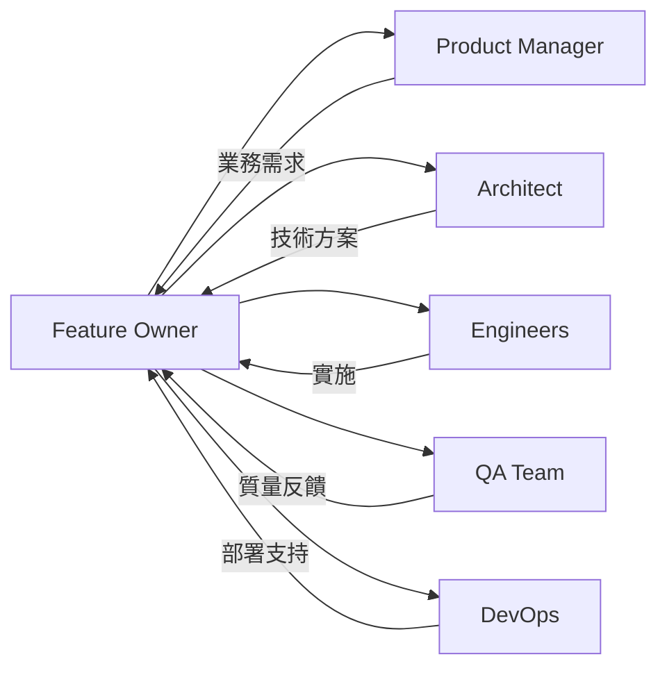
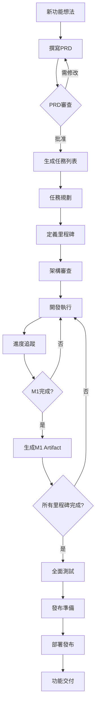

# Feature Owner 完整使用手冊

**版本**：1.0  
**最後更新**：2024-11-21

---

## 📖 目錄

1. [簡介](#簡介)
2. [角色與職責](#角色與職責)
3. [快速開始](#快速開始)
4. [工作流程詳解](#工作流程詳解)
5. [工具使用指南](#工具使用指南)
6. [最佳實踐](#最佳實踐)
7. [常見問題](#常見問題)
8. [資源與參考](#資源與參考)

---

## 簡介

### 什麼是Feature Owner？

Feature Owner（功能負責人）是負責特定功能從概念到交付全生命週期的角色。作為Feature Owner，您將：

- ✅ 理解和傳達產品需求
- ✅ 協調跨職能團隊
- ✅ 管理進度和風險
- ✅ 確保質量和及時交付
- ✅ 維護文檔和知識傳承

### 本系統的價值

Feature Owner工作流程模板系統提供：

- 📋 **標準化模板**：確保一致性和完整性
- 🔄 **自動化工具**：減少重複性工作
- 📊 **進度追蹤**：實時了解專案狀態
- 📚 **知識管理**：文檔化決策和經驗

---

## 角色與職責

### 核心職責

#### 需求管理
- 撰寫和維護PRD
- 與產品經理對齊需求
- 管理需求變更

#### 規劃與執行
- 將需求拆分為任務
- 定義里程碑和時間線
- 協調資源分配

#### 溝通協作
- 與架構師討論技術方案
- 與工程師澄清需求
- 與利益相關者同步進度

#### 質量保證
- 定義驗收標準
- 審查交付成果
- 確保文檔完整

### 與其他角色的協作



---

## 快速開始

### 環境準備

1. **確認工具已安裝**
   ```bash
   # 檢查Python版本
   python --version  # 應該 >= 3.7
   
   # 檢查Git
   git --version
   ```

2. **了解目錄結構**
   ```
   .agent/workflows/       # 工作流程定義
   templates/feature-owner/ # 文檔模板
   scripts/feature-owner/  # 自動化工具
   docs/features/         # 功能文檔目錄
   ```

### 初始化新功能（5分鐘）

```bash
# 使用初始化工具
python scripts/feature-owner/init_feature.py \
  --name "User Authentication" \
  --owner "Your Name"

# 這會創建完整的目錄結構和模板文件
```

### 第一個功能（30分鐘）

1. **填寫PRD** (15分鐘)
   - 打開`docs/features/your-feature/PRD.md`
   - 填寫功能背景、目標用戶、功能需求
   - 保存並提交到Git

2. **生成任務列表** (5分鐘)
   ```bash
   python scripts/feature-owner/generate_tasks.py \
     --prd docs/features/your-feature/PRD.md \
     --output docs/features/your-feature/TASKS.md
   ```

3. **審查和調整** (10分鐘)
   - 審查生成的任務列表
   - 細化任務描述
   - 與團隊討論並分配

---

## 工作流程詳解

### 完整流程圖



### 階段一：需求與設計（1-2週）

#### 1.1 撰寫PRD

**輸入**：產品需求、用戶反饋、業務目標

**工具**：`templates/feature-owner/PRD_TEMPLATE.md`

**關鍵活動**：
- 定義功能目標和成功指標
- 編寫用戶故事
- 明確範圍（什麼包含、什麼不包含）
- 識別依賴和風險

**輸出**：完整的PRD文檔

**檢查點**：
- [ ] 產品經理批准
- [ ] 利益相關者認可
- [ ] 團隊理解需求

#### 1.2 架構設計

**工具**：`templates/feature-owner/ARCHITECTURE_REVIEW_TEMPLATE.md`

**與架構師協作**：
1. 討論技術方案
2. 評估性能和擴展性
3. 識別技術風險
4. 做出技術決策（記錄ADR）

**輸出**：
- 架構設計文檔
- 數據模型設計
- API設計規範
- 技術決策記錄(ADRs)

### 階段二：規劃（3-5天）

#### 2.1 任務拆分

**工作流程**：`/task-planning`

**工具**：`scripts/feature-owner/generate_tasks.py`

**步驟**：
1. 運行任務生成工具
2. 團隊評審任務列表
3. 細化任務和驗收標準
4. 評估工時
5. 分配負責人

**最佳實踐**：
- 任務粒度：1-3天完成
- 使用SMART原則
- 垂直拆分優於水平拆分

#### 2.2 定義里程碑

**工具**：`templates/feature-owner/MILESTONE_TEMPLATE.md`

**建議結構**：
- M0: 設計與規劃
- M1: 基礎設施
- M2: 核心功能
- M3: 優化與測試
- M4: 發布準備

**每個里程碑定義**：
- 明確的目標
- 可演示的成果
- 驗收標準
- 時間線

### 階段三：執行（4-8週）

#### 3.1 日常管理

**每日站會** (15分鐘)：
- 昨天完成了什麼
- 今天計劃做什麼
- 遇到什麼阻塞

**每週進度會** (30-45分鐘)：
- 本週進展總結
- 下週計劃
- 風險和問題
- 需要的支持

#### 3.2 進度追蹤

**工作流程**：`/milestone-tracking`

**工具**：`scripts/feature-owner/track_milestone.py`

**追蹤內容**：
- 任務完成率
- 速度趨勢
- 質量指標
- 風險狀態

**視覺化**：
```bash
# 查看進度報告
python scripts/feature-owner/track_milestone.py \
  --feature "your-feature" \
  --status
```

#### 3.3 問題管理

**識別問題**：
- 每日站會收集
- 代碼審查發現
- 測試結果反饋

**處理流程**：
1. 記錄問題
2. 評估影響和優先級
3. 分配責任人
4. 追蹤到解決
5. 總結經驗

### 階段四：測試與發布（1-2週）

#### 4.1 質量保證

**檢查清單**：`templates/feature-owner/IMPLEMENTATION_CHECKLIST_TEMPLATE.md`

**關鍵檢查**：
- [ ] 所有P0功能完成
- [ ] 測試覆蓋率達標
- [ ] 性能指標符合預期
- [ ] 安全審查通過
- [ ] 文檔完整

#### 4.2 發布準備

**Artifact生成**：
```bash
# 生成發布說明
python scripts/feature-owner/generate_artifact.py \
  --feature "your-feature" \
  --type release-notes \
  --version "1.0.0"
```

**發布前檢查**：
- [ ] 部署文檔準備
- [ ] 回滾方案就緒
- [ ] 監控配置完成
- [ ] 團隊培訓完成
- [ ] 用戶溝通計劃準備

---

## 工具使用指南

### 初始化工具

```bash
python scripts/feature-owner/init_feature.py \
  --name "Feature Name" \
  --owner "Your Name"
```

**功能**：
- 創建功能目錄結構
- 複製所有必要模板
- 初始化Git追蹤

### 任務生成工具

```bash
python scripts/feature-owner/generate_tasks.py \
  --prd path/to/PRD.md \
  --output path/to/TASKS.md \
  --owner "Your Name"
```

**功能**：
- 從PRD提取功能需求
- 生成初始任務列表
- 建議任務結構

### 里程碑追蹤工具

```bash
# 查看狀態
python scripts/feature-owner/track_milestone.py \
  --feature "feature-name" \
  --status

# 更新進度
python scripts/feature-owner/track_milestone.py \
  --feature "feature-name" \
  --milestone "M1" \
  --update
```

**功能**：
- 計算完成百分比
- 生成進度報告
- 識別風險

### Artifact生成工具

```bash
# 生成里程碑報告
python scripts/feature-owner/generate_artifact.py \
  --feature "feature-name" \
  --type milestone-report \
  --milestone "M1"

# 生成發布說明
python scripts/feature-owner/generate_artifact.py \
  --feature "feature-name" \
  --type release-notes \
  --version "1.0.0"
```

---

## 最佳實踐

### 文檔管理

✅ **應該做的**：
- 及時更新文檔，不要拖到最後
- 使用清晰的標題和章節結構
- 包含圖表和截圖增強理解
- 記錄"為什麼"而不只是"是什麼"
- 所有文檔納入版本控制

❌ **避免做的**：
- 不要複製粘貼代碼到文檔
- 不要使用模糊的術語
- 不要忘記更新相關文檔
- 不要假設讀者有背景知識

### 溝通協作

✅ **有效溝通**：
- 定期同步，保持透明
- 及早報告問題和風險
- 用數據支持決策
- 傾聽團隊成員的意見

❌ **避免的陷阱**：
- 不要孤軍奮戰
- 不要隱瞞問題
- 不要過度承諾
- 不要忽視非技術利益相關者

### 進度管理

✅ **高效管理**：
- 使用數據驅動決策
- 主動識別和管理風險
- 慶祝小勝利和里程碑
- 從錯誤中學習

❌ **常見錯誤**：
- 不要過度樂觀估算
- 不要忽視警訊
- 不要等待問題自行解決
- 不要微觀管理團隊

---

## 常見問題

### Q1: PRD應該多詳細？

**A**: PRD應該詳細到工程師能夠理解"做什麼"，但不需要指定"怎麼做"。重點是業務邏輯和用戶價值，技術實現由工程師決定。

### Q2: 任務拆分的粒度如何把握？

**A**: 理想的任務應該在1-3天內完成。如果超過3天，考慮進一步拆分。太小的任務（<4小時）會增加管理成本。

### Q3: 如何處理需求變更？

**A**: 
1. 評估變更影響
2. 更新PRD文檔
3. 調整任務列表和里程碑
4. 與團隊和利益相關者溝通
5. 記錄變更決策

### Q4: 里程碑延期怎麼辦？

**A**:
1. 分析延期原因
2. 評估影響範圍
3. 考慮調整方案：增加資源、調整範圍、延期發布
4. 與利益相關者坦誠溝通
5. 記錄經驗教訓

### Q5: 如何平衡質量和速度？

**A**: 
- 優先保證P0功能的質量
- 使用測試覆蓋率作為質量門檻
- 技術債務要記錄並計劃償還
- 不要為了趕deadline犧牲架構和安全性

---

## 資源與參考

### 工作流程

- [Feature Owner主工作流程](../.agent/workflows/feature-owner-main.md)
- [任務規劃工作流程](../.agent/workflows/task-planning.md)
- [里程碑追蹤工作流程](../.agent/workflows/milestone-tracking.md)
- [Artifact生成工作流程](../.agent/workflows/artifact-generation.md)

### 模板

- [PRD模板](../../templates/feature-owner/PRD_TEMPLATE.md)
- [任務列表模板](../../templates/feature-owner/TASK_LIST_TEMPLATE.md)
- [里程碑模板](../../templates/feature-owner/MILESTONE_TEMPLATE.md)
- [架構審查模板](../../templates/feature-owner/ARCHITECTURE_REVIEW_TEMPLATE.md)
- [實施檢查清單](../../templates/feature-owner/IMPLEMENTATION_CHECKLIST_TEMPLATE.md)
- [發布說明模板](../../templates/feature-owner/RELEASE_NOTES_TEMPLATE.md)

### 進階閱讀

- [最佳實踐指南](./BEST_PRACTICES.md)
- [示例文檔](./EXAMPLES.md)

---

## 附錄

### 術語表

| 術語 | 定義 |
|------|------|
| PRD | Product Requirements Document，產品需求文檔 |
| ADR | Architecture Decision Record，架構決策記錄 |
| P0/P1/P2 | 優先級標記：Must Have / Should Have / Nice to Have |
| Artifact | 在開發過程中產生的重要文檔和交付物 |
| Milestone | 里程碑，標誌階段性目標的完成 |
| Sprint | 衝刺，固定時長的開發週期（通常1-2週） |

### 快速命令參考

```bash
# 初始化功能
python scripts/feature-owner/init_feature.py --name "NAME" --owner "OWNER"

# 生成任務
python scripts/feature-owner/generate_tasks.py --prd PRD.md --output TASKS.md

# 查看進度
python scripts/feature-owner/track_milestone.py --feature "NAME" --status

# 生成報告
python scripts/feature-owner/generate_artifact.py --feature "NAME" --type TYPE

# 列出可用的Artifact類型
python scripts/feature-owner/generate_artifact.py --list-types
```

---

**文檔維護者**：Feature Owner工作流程團隊  
**最後更新**：2024-11-21  
**版本**：1.0

如有問題或建議，請提交Issue或聯繫團隊。祝您成為優秀的Feature Owner！🚀
