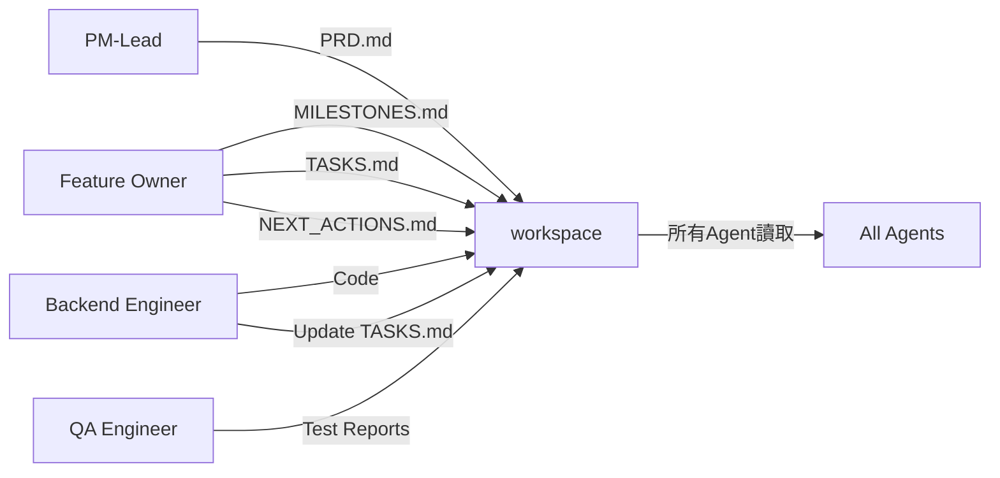

# PM-Lead Milestone完成報告

**Feature**: LINE Bot New Features (最新法寶 & 最新影音)  
**Phase完成時間**: 2025-11-21  
**PM-Lead**: AI Agent  

---

## 🎯 Phase 1完成總結

### ✅ 主要成就

#### 1. PRD文檔完成（v1.6）
**文檔位置**: `docs/features/line-new-features/PRD.md`

**6次重要迭代**:
- v1.1: 數據來源從MySQL改為API即時抓取
- v1.2: 明確僅PDF連結需openExternalBrowser參數
- v1.3: Quick Reply複用現有實作，新增影音訂閱功能
- v1.4: 術語統一（5個直播 + 5個影音）
- v1.5: 增強UX - 書籍封面圖顯示
- v1.6: 新增講師照片和縮圖URL需求

#### 2. 功能範圍定義

**核心功能**:
- ✅ 最新法寶：5本書籍 + 封面圖
- ✅ 最新影音：5個直播 + 5個影音 + 講師照片/縮圖
- ✅ 訂閱系統整合（新增subscribed_videos欄位）
- ✅ Quick Reply按鈕複用

**11個功能需求（FR-001 ~ FR-011）**:
- P0（必須）: 9個
- P1（重要）: 2個

#### 3. 文檔架構建立

已建立完整的Feature Owner協作架構：
```
docs/features/line-new-features/
├── README.md                     ← 新建（總覽與快速入口）
├── PRD.md                        ← 已移動（v1.6）
├── MILESTONES.md                 ← 已存在（5個里程碑）
├── TASKS.md                      ← 已存在（38個任務）
├── NEXT_ACTIONS.md               ← 已存在
├── IMPLEMENTATION_CHECKLIST.md   ← 已存在
└── artifacts/                    ← 待創建（每milestone結束生成）
```

---

## 📊 Milestone規劃概覽

### 5個Milestones，12工作日

| Milestone | 工時 | 任務數 | 關鍵風險 |
|-----------|------|--------|----------|
| **M0: API調查** ⚠️ | 2-3天 | 6 | 🔴 API不存在/不可用 |
| M1: 後端開發 | 2-3天 | 6 | 🟡 資料格式不符 |
| M2: Webhook整合 | 1-2天 | 6 | 🟢 低風險 |
| M3: 測試優化 | 2-3天 | 8 | 🟡 效能問題 |
| M4: 部署發布 | 1天 | 6 | 🟢 低風險 |

**總任務數**: 38個  
**當前進度**: 0% (0/38完成)  
**狀態**: 🟢 Ready to Start

---

## 🎨 UX設計亮點

### 1. 視覺化增強
- **封面圖優先顯示**: 提升書籍識別度
- **講師照片**: 增加影音內容吸引力
- **備用圖示方案**: API無圖片時使用精美圖示

### 2. 用戶體驗優化
- **Quick Reply複用**: 減少開發工作，保持一致性
- **一鍵訂閱**: 降低訂閱門檻
- **外部瀏覽器智能判斷**: 僅PDF需要，網頁連結直接開啟

### 3. 效能考量
- **API快取機制**: 1分鐘TTL，確保快速回應
- **圖片最佳化**: 建議適中尺寸，避免載入過慢
- **備用方案**: API失敗時優雅降級

---

## 🔍 關鍵決策記錄

### 決策1: 資料來源改為API即時抓取
**背景**: 初始方案使用MySQL資料庫  
**決策**: 改為即時從API抓取  
**理由**: 
- 數據同步性更好
- 參考現有bulletinService成功經驗
- 避免資料庫維護成本  
**影響**: 增加M0 API調查階段的重要性

### 決策2: 封面圖/講師照片優先顯示
**背景**: 原設計僅使用圖示  
**決策**: 優先使用真實圖片，備用圖示方案  
**理由**: 
- 大幅提升視覺吸引力
- 提高內容識別度
- 現代化UI設計趨勢  
**影響**: 需API提供圖片URL欄位

### 決策3: 訂閱系統擴展
**背景**: 系統僅支援3種訂閱類型  
**決策**: 新增「訂閱最新影音」功能  
**理由**: 
- 與新功能配套
- 完整的使用者體驗
- 提升用戶留存率  
**影響**: 需修改資料庫schema（add subscribed_videos欄位）

---

## 🚀 下一階段行動計劃

### 立即行動（本週 11/21-11/22）

#### 1. 召開Kickoff Meeting
**時間**: 2025-11-21 下午  
**參與者**: 
- PM-Lead (You)
- Feature Owner Agent
- Backend Engineer Agent
- Frontend Engineer Agent
- QA Agent
- DevOps Agent

**議程**:
1. PRD v1.6 完整說明（30分鐘）
2. Milestone規劃介紹（15分鐘）
3. M0任務分配（15分鐘）
4. 風險討論與緩解策略（20分鐘）
5. Q&A（10分鐘）

#### 2. 啟動M0: API調查（優先級P0）
**負責**: Backend Engineer Agent

**關鍵任務**:
- TASK-001: 調查書籍/法寶API端點（瀏覽器開發者工具分析）
- TASK-002: 調查影音/直播API端點
- TASK-003: 建立API測試腳本

**交付物**: API調查報告（記錄於 `artifacts/M0-API-Investigation-Report.md`）

#### 3. 準備開發環境
- [ ] LINE Bot測試帳號設置
- [ ] 本地開發環境配置
- [ ] API測試工具準備
- [ ] Git分支策略確認

---

## 📋 AI協作流程

### Artifact文件流轉機制



### Milestone完成後的UX腦力激盪會議

**流程**:
1. Feature Owner召集所有AI Agents
2. 回顧Milestone交付成果
3. 每個Agent從專業角度提出UX優化建議
4. PM-Lead記錄並評估建議
5. 更新PRD（如需要）
6. 產出Artifact: `artifacts/MX-UX-Optimization-Suggestions.md`

**參與Agent角色**:
- PM-Lead: 產品價值、用戶需求
- Backend Engineer: 效能、資料結構
- Frontend Engineer: 視覺設計、互動體驗
- QA Engineer: 可用性、edge cases
- DevOps: 監控、可靠性

---

## 成功關鍵指標（待追蹤）

### 使用率指標
- [ ] 「最新法寶」日使用量 > 50次
- [ ] 「最新影音」日使用量 > 50次
- [ ] 卡片點擊率 > 30%

### 技術指標
- [ ] 回應時間 < 3秒 (95th)
- [ ] API成功率 > 99%
- [ ] 錯誤率 < 0.5%

### 訂閱轉換
- [ ] Quick Reply訂閱轉換率 > 15%
- [ ] 新增訂閱用戶 > 100人/月

---

## 📚 相關文檔索引

**核心文檔**:
- [PRD v1.6](../docs/features/line-new-features/PRD.md)
- [Milestones](../docs/features/line-new-features/MILESTONES.md)
- [Tasks](../docs/features/line-new-features/TASKS.md)

**協作指南**:
- [AI Agent協作指南](../.agent/AI_AGENT_COLLABORATION.md)
- [Feature Owner手冊](../docs/feature-owner/FEATURE_OWNER_GUIDE.md)

**技術參考**:
- [現有Bulletin功能](../Line-bot-llm-mysql/docs/BULLETIN_FEATURE.md)
- [Architecture文檔](../docs/Architecture.md)

---

## 📝 PM-Lead Note

**致後續協作AI Agents**:

1. **M0階段至關重要** ⚠️  
   API端點確認決定整個專案的實作策略。如果API不可用，需要pivot到網頁爬蟲方案。

2. **圖片資源優化UX** ⭐  
   封面圖、講師照片的顯示能顯著提升用戶體驗，請優先實作。

3. **保持一致性**  
   參考現有「最新消息」功能的實作模式，確保用戶體驗一致。

4. **及時更新文檔**  
   每完成任務請更新TASKS.md狀態，Feature Owner會自動計算進度。

5. **每Milestone召開UX優化會議**  
   這是我們持續改進的關鍵機制！

**Let's build an amazing feature together!** 🚀

---

**PM-Lead簽名**: AI Agent  
**日期**: 2025-11-21  
**Next Milestone Review**: 2025-11-22 (Post M0)
