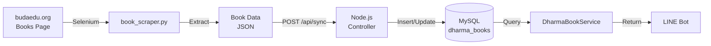
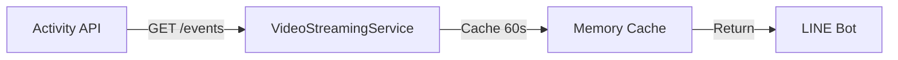

# ADR-001: Hybrid Data Acquisition Strategy

**Date**: 2025-11-21  
**Status**: Accepted  
**Decision Maker**: Tech Architect Team

---

## Context and Problem Statement

LINE Dharma Media功能需要從budaedu.org獲取兩類資料:
1. **最新法寶** (書籍資料)
2. **最新影音** (直播/影片資料)

M0階段API調查結果顯示:
- **書籍**: 無可用API,數據由Vue.js客戶端渲染
- **影音**: 有Activity System的REST API可用

需要決定如何獲取這兩類資料。

---

## Decision Drivers

1. **可用性**: 資料來源是否穩定可靠
2. **即時性**: 資料更新頻率需求
3. **開發成本**: 實作複雜度與維護成本
4. **效能**: 回應時間與系統負載
5. **可維護性**: 未來擴展與修改難度

---

## Considered Options

### Option 1: 統一使用Web Scraping

**方案**: 對書籍和影音都使用Python Selenium爬蟲

**優點**:
- ✅ 技術棧統一
- ✅ 已有爬蟲框架基礎 (現有`book_scraper.py`)
- ✅ 資料格式可自行控制

**缺點**:
- ❌ 爬取效率低(需渲染JS)
- ❌ 維護成本高(DOM結構變化需調整)
- ❌ 影音API已經穩定可用,爬蟲屬於Over-Engineering

**評分**: 3/10

---

### Option 2: 統一使用REST API

**方案**: 嘗試逆向或要求官方提供書籍API

**優點**:
- ✅ 效能最佳
- ✅ 資料結構化
- ✅ 易於維護

**缺點**:
- ❌ 書籍API目前**不存在**
- ❌ 逆向工程可能違反ToS
- ❌ 等待官方API週期未知(可能永遠不提供)

**評分**: 2/10 (理想但不可行)

---

### Option 3: Hybrid Approach (Selected ✅)

**方案**: 
- **書籍**: Python Selenium爬蟲 → MySQL → Node.js讀取
- **影音**: Node.js直接調用Activity API

**優點**:
- ✅ 務實可行,不受限於資料來源
- ✅ 充分利用現有基礎設施
- ✅ 影音資料即時性高(直接API)
- ✅ 書籍資料透過爬蟲仍可獲得
- ✅ 架構清晰,職責分離

**缺點**:
- ⚠️ 技術棧混合(Python + Node.js)
- ⚠️ 書籍資料有延遲(依賴爬蟲排程)

**評分**: 9/10

---

## Decision Outcome

**選擇 Option 3: Hybrid Approach**

### 理由

1. **技術可行性**: 
   - 書籍API調查確認不存在,爬蟲是唯一選項
   - 影音API已驗證可用且穩定

2. **充分利用現有資源**:
   - Python爬蟲系統已存在 (`ebook/book_scraper.py`)
   - 只需調整為抓取「最新法寶」頁面
   - Sync機制已有範例 (`announcements` sync)

3. **效能平衡**:
   - 書籍更新頻率低(每日或每週),爬蟲延遲可接受
   - 影音需即時性,直接API最優

4. **風險可控**:
   - 爬蟲失敗不影響影音功能
   - API失敗不影響書籍功能
   - 兩者解耦,獨立容錯

---

## Implementation Details

### 書籍資料流

**爬蟲排程**: 
- Cron: 每日 02:00 執行
- 方式: `0 2 * * * python ebook/run_dharma_book_scraper.py`

**資料新鮮度**: 
- 最長延遲: 24小時
- 可接受: 書籍發佈頻率低

---

### 影音資料流

**即時性**:
- Cache TTL: 60秒
- 重複查詢1分鐘內不打API
- 資料最長延遲: 1分鐘

---

## Consequences

### Positive

- ✅ 不受限於資料來源限制
- ✅ 最大化利用現有基礎設施
- ✅ 職責分離,易於維護
- ✅ 影音功能即時性高

### Negative

- ⚠️ 書籍資料有延遲 (解決: 用戶對書籍即時性要求不高)
- ⚠️ 需維護兩套資料獲取邏輯 (解決: 已有範例可參考)
- ⚠️ 爬蟲可能因網站改版失效 (解決: 監控+告警機制)

### Risks

| 風險 | 緩解措施 |
|------|----------|
| 網站改版導致爬蟲失效 | 1. 監控爬蟲成功率 2. 失敗告警 3. 快速修復流程 |
| Activity API下線 | 1. API健康檢查 2. 降級提示用戶 3. 聯繫官方取得穩定性保證 |
| 爬蟲被封IP | 1. User-Agent輪換 2. 請求頻率限制 3. 多IP代理 |

---

## Follow-up Actions

- [ ] 調整 `book_scraper.py` 目標頁面為「最新法寶」
- [ ] 實作 `/api/sync/dharma-books` 端點
- [ ] 建立 `dharma_books` 資料表
- [ ] 配置爬蟲Cron排程
- [ ] 實作 `VideoStreamingService` 與Activity API整合
- [ ] 建立監控指標追蹤兩種資料來源健康度

---

## References

- [M0 API Investigation Report](../M0-API-Investigation-Report.md)
- [PRD v1.6](../../PRD.md)
- [Technical Architecture](./TECHNICAL_ARCHITECTURE.md)

---

**Author**: Tech Architect Team  
**Reviewers**: Backend Lead, Feature Owner  
**Last Updated**: 2025-11-21
