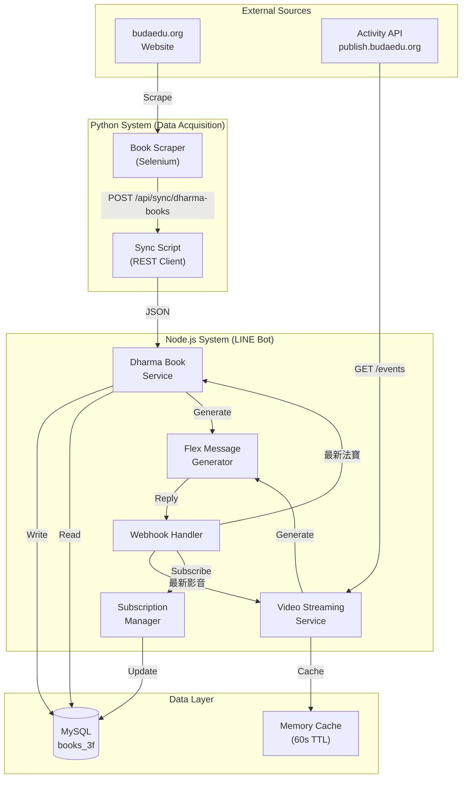
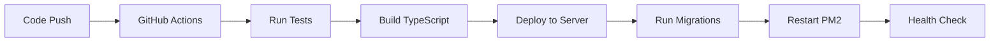

# LINE Dharma Media - 技術架構文檔

**Version**: 1.0  
**Date**: 2025-11-21  
**Tech Architect**: System Architecture Team  
**Status**: Planning Phase

---

## 1. 架構概述

### 1.1 系統定位

LINE Dharma Media 功能是對現有 Buddhist Education System 的擴展,新增「最新法寶」和「最新影音」兩大核心功能。

### 1.2 整合策略 (Hybrid Architecture)



### 1.3 設計原則

1. **數據來源適配** - Books用爬蟲,Videos用API,各自最優方案
2. **快取優先** - 1分鐘TTL避免頻繁查詢
3. **錯誤容錯** - API失敗不crash Bot
4. **視覺優化** - 優先顯示封面圖/講師照

---

## 2. 技術棧選型

### 2.1 核心技術

| Component | Technology | Version | Rationale |
|-----------|-----------|---------|-----------|
| **Data Scraping** | Python + Selenium | 4.0+ | 處理Vue.js動態渲染頁面 |
| **Backend API** | Node.js + TypeScript | 18+ / 5.0 | 現有LINE Bot技術棧 |
| **Database** | MySQL | 8.0 | 現有books_3f數據庫 |
| **Cache** | Node Memory Cache | - | 輕量級,適合60s短TTL |
| **LINE SDK** | @line/bot-sdk | 8.0+ | 官方SDK |
| **HTTP Client** | axios | 1.6+ | 支援timeout/retry |

### 2.2 新增依賴評估

```json
{
  "dependencies": {
    "axios": "^1.6.0",          // API調用
    "node-cache": "^5.1.2"      // 記憶體快取
  }
}
```

**評估**: 
- ✅ axios - 已在專案中使用
- ✅ node-cache - 輕量級,無需Redis

---

## 3. API設計

### 3.1 Python → Node.js Sync API

#### POST /api/sync/dharma-books

**Purpose**: 接收Python爬蟲同步的書籍資料

**Request**:
```http
POST /api/sync/dharma-books
Content-Type: application/json
Authorization: Bearer {SYNC_API_KEY}

{
  "books": [
    {
      "title": "佛說阿彌陀經",
      "author": "姚秦 鳩摩羅什譯",
      "coverUrl": "https://www.budaedu.org/covers/001.jpg",
      "pdfUrl": "https://www.budaedu.org/pdf/001.pdf",
      "detailUrl": "https://www.budaedu.org/#/dharmas/001",
      "publishDate": "2025-11-20"
    }
  ],
  "syncedAt": "2025-11-21T10:00:00Z"
}
```

**Response**:
```json
{
  "success": true,
  "message": "Successfully synced 5 books",
  "insertedCount": 3,
  "updatedCount": 2,
  "timestamp": "2025-11-21T10:00:01Z"
}
```

**Error Handling**:
- 401: Invalid API Key
- 400: Invalid data format
- 500: Database error

---

### 3.2 External Activity API Integration

#### GET https://publish.budaedu.org/activity/public/api/events

**Purpose**: 獲取最新影音/直播資料

**Parameters**:
```typescript
{
  filter: {
    has_live_stream: true      // 過濾直播
  },
  include: 'organizer,schedules.places',
  sort: '-start_date',
  per_page: 10
}
```

**Response Mapping**:
```typescript
interface ActivityAPIResponse {
  data: Array<{
    id: number;
    name: string;              // → title
    leader: string;            // → instructor
    start_date: string;        // → streamDate
    cover_image?: string;      // → thumbnailUrl
    schedules: Array<{
      places: Array<{
        live_streaming_url: string;  // → streamUrl
      }>
    }>;
    organizer: {
      name: string;            // → instructor (fallback)
      photo_url?: string;      // → instructorPhotoUrl
    }
  }>;
}
```

---

## 4. 數據庫設計

### 4.1 新增Table: dharma_books

```sql
CREATE TABLE dharma_books (
    id INT AUTO_INCREMENT PRIMARY KEY,
    title VARCHAR(255) NOT NULL,
    author VARCHAR(255),
    cover_url VARCHAR(500),
    pdf_url VARCHAR(500) NOT NULL,
    detail_url VARCHAR(500),
    publish_date DATE,
    created_at TIMESTAMP DEFAULT CURRENT_TIMESTAMP,
    updated_at TIMESTAMP DEFAULT CURRENT_TIMESTAMP ON UPDATE CURRENT_TIMESTAMP,
    
    INDEX idx_publish_date (publish_date DESC),
    INDEX idx_created_at (created_at DESC),
    UNIQUE KEY uk_pdf_url (pdf_url)
) ENGINE=InnoDB DEFAULT CHARSET=utf8mb4 COLLATE=utf8mb4_unicode_ci;
```

**設計考量**:
- `pdf_url` 做UNIQUE KEY,避免重複爬取
- `publish_date` 索引用於排序查詢
- `cover_url` 可NULL,降級顯示預設圖

### 4.2 修改Table: subscribers

```sql
ALTER TABLE subscribers 
ADD COLUMN subscribed_videos TINYINT(1) DEFAULT 0 
AFTER subscribed_new_books;
```

**索引評估**:
```sql
-- 建議新增複合索引加速訂閱查詢
CREATE INDEX idx_video_subscribers 
ON subscribers(subscribed_videos, is_active) 
WHERE subscribed_videos = 1;
```

---

## 5. 服務層架構

### 5.1 DharmaBookService

**File**: `src/services/dharmaBookService.ts`

```typescript
class DharmaBookService {
  private cache: NodeCache;
  
  constructor() {
    this.cache = new NodeCache({ stdTTL: 60 }); // 1分鐘
  }
  
  /**
   * 獲取最新5本書籍
   */
  async getLatestBooks(limit: number = 5): Promise<DharmaBook[]> {
    const cacheKey = `latest_books_${limit}`;
    const cached = this.cache.get<DharmaBook[]>(cacheKey);
    
    if (cached) {
      return cached;
    }
    
    const books = await db.query(`
      SELECT id, title, author, cover_url, pdf_url, detail_url, publish_date
      FROM dharma_books
      ORDER BY publish_date DESC, created_at DESC
      LIMIT ?
    `, [limit]);
    
    this.cache.set(cacheKey, books);
    return books;
  }
  
  /**
   * 同步書籍資料 (由Python爬蟲調用)
   */
  async syncBooks(books: DharmaBookInput[]): Promise<SyncResult> {
    let inserted = 0, updated = 0;
    
    for (const book of books) {
      const result = await db.query(`
        INSERT INTO dharma_books (title, author, cover_url, pdf_url, detail_url, publish_date)
        VALUES (?, ?, ?, ?, ?, ?)
        ON DUPLICATE KEY UPDATE
          title = VALUES(title),
          author = VALUES(author),
          cover_url = VALUES(cover_url),
          updated_at = CURRENT_TIMESTAMP
      `, [book.title, book.author, book.coverUrl, book.pdfUrl, book.detailUrl, book.publishDate]);
      
      result.affectedRows === 1 ? inserted++ : updated++;
    }
    
    // 清除快取
    this.cache.flushAll();
    
    return { inserted, updated };
  }
}
```

**安全考量**:
- ✅ 參數化查詢防SQL注入
- ✅ UPSERT邏輯避免重複
- ✅ 快取失效機制

---

### 5.2 VideoStreamingService

**File**: `src/services/videoStreamingService.ts`

```typescript
class VideoStreamingService {
  private cache: NodeCache;
  private apiClient: AxiosInstance;
  
  constructor() {
    this.cache = new NodeCache({ stdTTL: 60 });
    this.apiClient = axios.create({
      baseURL: 'https://publish.budaedu.org/activity/public/api',
      timeout: 5000,
      httpsAgent: new https.Agent({ 
        rejectUnauthorized: process.env.NODE_ENV === 'production' 
      })
    });
  }
  
  /**
   * 獲取最新影音內容 (5直播 + 5影音)
   */
  async getLatestContent(): Promise<Stream[]> {
    const cacheKey = 'latest_streams';
    const cached = this.cache.get<Stream[]>(cacheKey);
    
    if (cached) {
      return cached;
    }
    
    try {
      const [liveData, videoData] = await Promise.all([
        this.fetchEvents({ has_live_stream: true }, 5),
        this.fetchEvents({ type: 'video' }, 5)
      ]);
      
      const streams = [...liveData, ...videoData].map(this.mapToStream);
      this.cache.set(cacheKey, streams);
      return streams;
      
    } catch (error) {
      logger.error('VideoStreamingService error:', error);
      throw new ServiceError('無法獲取影音資料,請稍後再試');
    }
  }
  
  private async fetchEvents(filter: any, limit: number) {
    const response = await this.apiClient.get('/events', {
      params: {
        filter,
        include: 'organizer,schedules.places',
        sort: '-start_date',
        per_page: limit
      }
    });
    return response.data.data;
  }
  
  private mapToStream(event: any): Stream {
    return {
      id: event.id.toString(),
      title: event.name,
      instructor: event.leader || event.organizer?.name,
      instructorPhotoUrl: event.organizer?.photo_url,
      thumbnailUrl: event.cover_image,
      streamDate: new Date(event.start_date),
      streamUrl: event.schedules?.[0]?.places?.[0]?.live_streaming_url,
      type: event.has_live_stream ? 'live' : 'video'
    };
  }
}
```

**容錯設計**:
- ✅ Timeout 5秒
- ✅ SSL憑證環境區分
- ✅ 異常轉換為用戶友好訊息

---

## 6. Flex Message設計

### 6.1 書籍Carousel

```typescript
function generateBookFlexMessage(books: DharmaBook[]): FlexBubble[] {
  return books.map(book => ({
    type: 'bubble',
    size: 'kilo',
    hero: {
      type: 'image',
      url: book.coverUrl || 'https://default-icon.png',
      size: 'full',
      aspectRatio: '20:13',
      aspectMode: 'cover'
    },
    body: {
      type: 'box',
      layout: 'vertical',
      contents: [
        {
          type: 'text',
          text: book.title,
          weight: 'bold',
          size: 'md',
          wrap: true,
          maxLines: 2
        },
        {
          type: 'text',
          text: book.author,
          size: 'sm',
          color: '#999999'
        },
        {
          type: 'text',
          text: book.publishDate,
          size: 'xs',
          color: '#aaaaaa'
        }
      ]
    },
    footer: {
      type: 'box',
      layout: 'vertical',
      contents: [
        {
          type: 'button',
          action: {
            type: 'uri',
            label: '詳細資訊',
            uri: book.detailUrl
          },
          style: 'link'
        },
        {
          type: 'button',
          action: {
            type: 'uri',
            label: '下載PDF',
            uri: `${book.pdfUrl}?openExternalBrowser=1`  // ⭐ Android修復
          },
          style: 'primary'
        }
      ]
    }
  }));
}
```

**UX優化**:
- ✅ 封面圖優先,降級預設圖示
- ✅ PDF連結加openExternalBrowser參數
- ✅ 標題限制2行避免溢出

### 6.2 影音Carousel

```typescript
function generateVideoFlexMessage(streams: Stream[]): FlexBubble[] {
  return streams.map(stream => ({
    type: 'bubble',
    size: 'kilo',
    hero: {
      type: 'box',
      layout: 'vertical',
      contents: [
        {
          type: 'image',
          url: stream.instructorPhotoUrl || stream.thumbnailUrl || getDefaultIcon(stream.type),
          size: 'full',
          aspectRatio: '16:9',
          aspectMode: 'cover'
        },
        {
          type: 'box',
          layout: 'baseline',
          contents: [{
            type: 'text',
            text: stream.type === 'live' ? '🔴 直播' : '📹 影音',
            color: '#ffffff',
            size: 'xs',
            weight: 'bold'
          }],
          position: 'absolute',
          top: '10px',
          left: '10px',
          paddingAll: '5px',
          backgroundColor: stream.type === 'live' ? '#ff0000' : '#00cc00',
          cornerRadius: '5px'
        }
      ]
    },
    body: {
      type: 'box',
      layout: 'vertical',
      contents: [
        {
          type: 'text',
          text: stream.title,
          weight: 'bold',
          size: 'md',
          wrap: true,
          maxLines: 2
        },
        {
          type: 'text',
          text: `講師: ${stream.instructor}`,
          size: 'sm',
          color: '#999999'
        }
      ]
    },
    footer: {
      type: 'box',
      layout: 'vertical',
      contents: [{
        type: 'button',
        action: {
          type: 'uri',
          label: stream.type === 'live' ? '觀看直播' : '觀看影片',
          uri: stream.streamUrl
        },
        style: 'primary'
      }]
    }
  }));
}
```

---

## 7. Webhook整合

### 7.1 指令處理流程

```typescript
// webhookHandler.ts
async function handleTextMessage(event: MessageEvent) {
  const text = event.message.text.trim();
  
  switch(text) {
    case '最新法寶':
      await handleLatestBooksCommand(event);
      break;
    
    case '最新影音':
      await handleLatestVideosCommand(event);
      break;
    
    default:
      // 現有邏輯
      break;
  }
}

async function handleLatestBooksCommand(event: MessageEvent) {
  try {
    const books = await dharmaBookService.getLatestBooks(5);
    const flexMessage = generateBookFlexMessage(books);
    const quickReply = generateSubscriptionQuickReply();
    
    await client.replyMessage(event.replyToken, {
      type: 'flex',
      altText: '最新法寶',
      contents: {
        type: 'carousel',
        contents: flexMessage
      },
      quickReply
    });
  } catch (error) {
    logger.error('handleLatestBooksCommand error:', error);
    await client.replyMessage(event.replyToken, {
      type: 'text',
      text: '抱歉,目前無法載入書籍資訊,請稍後再試。'
    });
  }
}
```

### 7.2 Quick Reply整合

```typescript
function generateSubscriptionQuickReply(): QuickReply {
  return {
    items: [
      {
        type: 'action',
        action: {
          type: 'message',
          label: '📰 訂閱最新消息',
          text: '訂閱最新消息'
        }
      },
      {
        type: 'action',
        action: {
          type: 'message',
          label: '📚 訂閱新書通知',
          text: '訂閱新書通知'
        }
      },
      {
        type: 'action',
        action: {
          type: 'message',
          label: '🎥 訂閱最新影音',  // ⭐ 新增
          text: '訂閱最新影音'
        }
      },
      {
        type: 'action',
        action: {
          type: 'message',
          label: '📊 訂閱狀態查詢',
          text: '訂閱狀態查詢'
        }
      },
      {
        type: 'action',
        action: {
          type: 'message',
          label: '❌ 取消訂閱',
          text: '取消訂閱'
        }
      }
    ]
  };
}
```

---

## 8. 效能與安全

### 8.1 效能優化策略

| 策略 | 實施方式 | 目標 |
|------|---------|------|
| **記憶體快取** | NodeCache 60s TTL | API調用減少98% |
| **資料庫索引** | publish_date, created_at | 查詢時間 < 50ms |
| **並行查詢** | Promise.all() | 直播+影音同時抓取 |
| **降級機制** | 預設圖片 | 封面/照片取得失敗不阻塞 |

### 8.2 安全措施

#### 8.2.1 API Key驗證

```typescript
// middleware/syncAuth.ts
export function verifySyncApiKey(req, res, next) {
  const apiKey = req.headers['authorization']?.replace('Bearer ', '');
  
  if (!apiKey || apiKey !== process.env.SYNC_API_KEY) {
    return res.status(401).json({
      error: 'Unauthorized',
      message: 'Invalid API key'
    });
  }
  
  next();
}
```

#### 8.2.2 輸入驗證

```typescript
import Joi from 'joi';

const syncBooksSchema = Joi.object({
  books: Joi.array().items(
    Joi.object({
      title: Joi.string().required().max(255),
      author: Joi.string().max(255),
      coverUrl: Joi.string().uri().allow(null, ''),
      pdfUrl: Joi.string().uri().required(),
      detailUrl: Joi.string().uri().required(),
      publishDate: Joi.date().iso()
    })
  ).min(1).max(100),
  syncedAt: Joi.date().iso().required()
});
```

#### 8.2.3 Rate Limiting

```typescript
import rateLimit from 'express-rate-limit';

const syncLimiter = rateLimit({
  windowMs: 60 * 1000,     // 1分鐘
  max: 5,                  // 最多5次同步請求
  message: 'Too many sync requests'
});

app.post('/api/sync/dharma-books', syncLimiter, verifySyncApiKey, syncBooksController);
```

---

## 9. 監控與告警

### 9.1 關鍵指標

```typescript
// metrics.ts
export const metrics = {
  // API調用
  api_calls_total: new Counter({
    name: 'dharma_api_calls_total',
    help: 'Total API calls',
    labelNames: ['service', 'status']
  }),
  
  // 回應時間
  api_duration_seconds: new Histogram({
    name: 'dharma_api_duration_seconds',
    help: 'API response time',
    labelNames: ['service']
  }),
  
  // 快取命中率
  cache_hits_total: new Counter({
    name: 'dharma_cache_hits_total',
    help: 'Cache hits',
    labelNames: ['service']
  })
};
```

### 9.2 健康檢查

```typescript
app.get('/health/dharma', async (req, res) => {
  try {
    // 檢查資料庫連接
    await db.query('SELECT 1 FROM dharma_books LIMIT 1');
    
    // 檢查Activity API
    await videoStreamingService.apiClient.get('/events', { 
      params: { per_page: 1 },
      timeout: 2000 
    });
    
    res.json({
      status: 'healthy',
      timestamp: new Date().toISOString(),
      services: {
        database: 'ok',
        activityAPI: 'ok'
      }
    });
  } catch (error) {
    res.status(503).json({
      status: 'unhealthy',
      error: error.message
    });
  }
});
```

---

## 10. 部署架構

### 10.1 環境配置

```bash
# .env.production
NODE_ENV=production
SYNC_API_KEY=<generate_secure_key>
ACTIVITY_API_BASE_URL=https://publish.budaedu.org/activity/public/api
CACHE_TTL=60
DB_POOL_SIZE=10
```

### 10.2 部署流程



---

## 11. 風險評估

| 風險 | 影響 | 機率 | 緩解措施 |
|------|------|------|----------|
| **Activity API改版** | High | Medium | 監控API變化,版本鎖定,快速適配 |
| **爬蟲被封** | High | Low | User-Agent輪換,請求頻率限制,官方API替代方案 |
| **資料庫效能瓶頸** | Medium | Low | 索引優化,讀寫分離,快取擴展 |
| **LINE API限制** | Medium | Low | 限流控制,降級策略 |

---

## 12. 後續優化方向

### 12.1 短期 (M2-M3)
- [ ] 實施Redis替代Memory Cache (支援分散式)
- [ ] 增加Prometheus監控
- [ ] 完善錯誤追蹤 (Sentry)

### 12.2 中期 (下個版本)
- [ ] 實施CDN加速封面圖載入
- [ ] 支援書籍/影音收藏功能
- [ ] 個性化推薦演算法

### 12.3 長期
- [ ] 微服務拆分 (Books Service + Videos Service)
- [ ] GraphQL API整合
- [ ] 機器學習內容推薦

---

**架構文件維護**: Tech Architect Team  
**最後更新**: 2025-11-21  
**下次審查**: M1完成後
